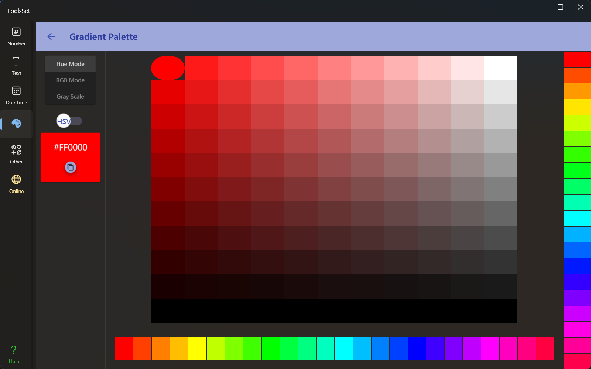

## 介绍

提供HSV/HSL梯度色板、RGB梯度色板和灰度梯度色板

## 使用方法
可以在左侧上方选择色板模式
* HSV/HSL梯度色板
  * 可以使用左侧开关切换HSV和HSL模式
  * 下方提供了24种颜色可以提供切换色相
  * 右侧提供了20种相同亮度和对比度的颜色可供色相对比
  * 中间区域按亮度和饱和度显示了阶梯颜色，点击颜色可以同步亮度和对比度到右侧颜色栏
* RGB梯度色板
  * 点击左侧的R、G、B三个按钮可以切换显示内容
  * 右侧颜色条可以选择RGB三种颜色所占比例
* 灰度梯度色板
  
> 选中颜色后可以在左侧查看颜色代码并复制
  
