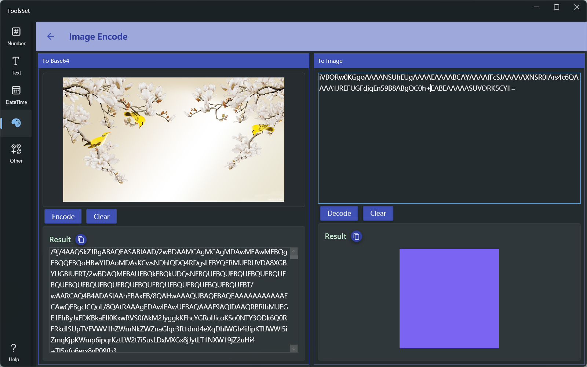

## 介绍

提供图片的Base64编码和解码功能

## 使用方法

左侧为Base64编码区域，右侧为Base64解码区域

### Base64编码
* 点击左侧上方图片区域，在弹出菜单中选择打开图片文件或粘贴图片
* 图片打开后点击【Encode】按钮即可在下方生成对应的Base64编码，点击【Clear】可以清除编码和图片，点击复制按钮可以快速复制结果文本
  
### Base64解码
* 在右侧上方文本框输入Base64文本
* 点击【Decode】按钮即可在下方显示解码后的图片，点击【Clear】可以清除编码和图片，点击复制按钮可以快速复制解码后的图片
