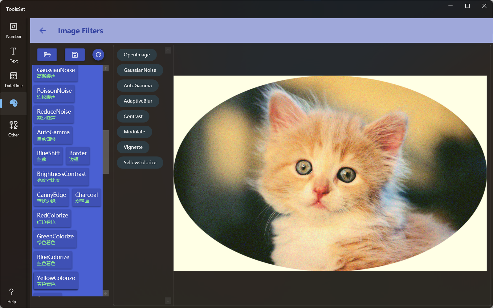

## 介绍

包含数十种图片滤镜，可以叠加使用

## 使用方法

* 点击上方打开文件按钮打开图片，图片将在右侧效果预览区显示
* 点击左侧滤镜列表中的滤镜，即可直接应用到图片，并且在右侧会显示应用的历史滤镜列表
* 可以点击历史滤镜列表中的项目返回到此滤镜效果，在此基础上应用滤镜时之后的滤镜将被移除
* 点击上方保存按钮可以将最终效果保存到文件
* 点击上方最右侧按钮可以撤销所有滤镜，返回到图片打开状态
  