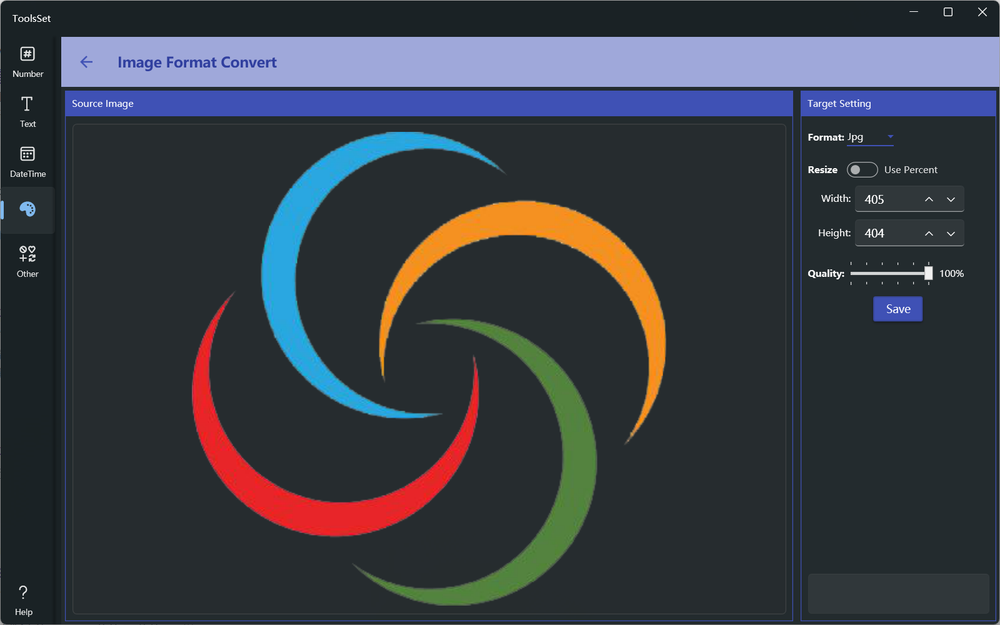

## 介绍

用于转换图片格式，图片源格式支持jpg、bmp、png、gif、tiff、ico，目标格式除了这些外还支持pdf，转换时还支持设置图片尺寸和质量

## 使用方法

* 点击左侧区域打开图片文件，打开后会显示图片预览
* 右侧可以设置目标格式选项，包括图片类型、调整尺寸和质量，选项根据选择的格式有所不同
  * png和jpg格式可以设置图片质量
  * ico格式的最大尺寸为256x256
  * 按比例调整尺寸最大为原尺寸的2倍
* 点击保存按钮可以按选择的目标格式保存文件
  