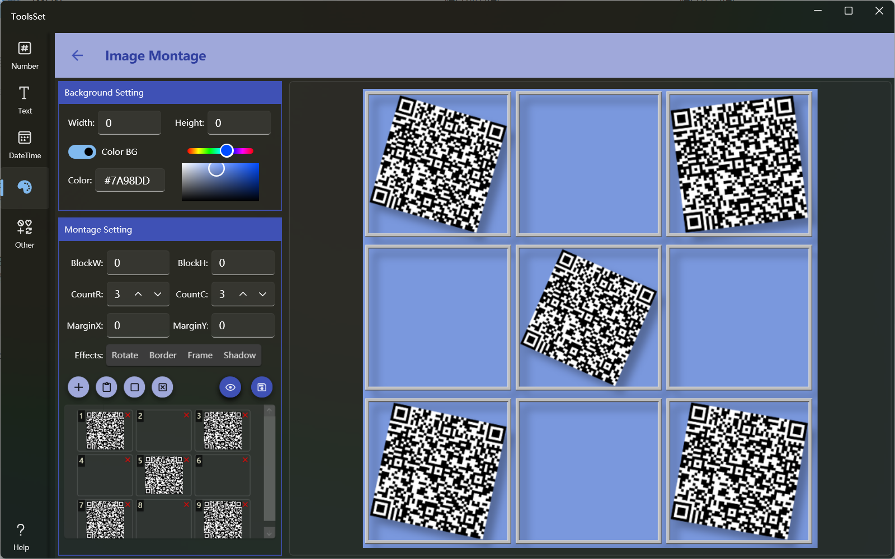

## 介绍
图片拼接合并工具，可以将多个图片合并成一个，支持设置行列数量、尺寸及间距，可以添加特效和背景色，可以使用空白占位

## 使用方法

* 设置背景：左侧上方可以设置图片背景
  * Width和Height：设置最终生成的图片尺寸，默认为0，即按照内容生成，最大不超过5000*5000
  * Color BG：背景色开关，打开时可以设置背景颜色，关闭时背景将使用透明
  * 设置颜色可以在文本框输入也可以通过颜色选择器设置
  * 
* 设置图片块参数：左侧中间区域可以设置图片块参数
  * BlockW和BlockH：设置图片块宽度和高度，默认为0，将根据所选图片自动计算，不超过500*500；设置后所有图片将都缩放到指定尺寸
  * CountR和CountC：设置排列时的行列数量，可以为0，为0表示此方向没有限制，如果网格总数小于图片数量，图片将会叠加
  * MarginX和MarginY：设置图片间距，范围为0~99
  * Effects：可以给图片块添加特效
    * Rotate：将图片块旋转随机角度
    * Border：给图片添加边框，添加边框会自动添加灰色背景
    * Frame：给图片添加相框
    * Shadow：给图片添加阴影 
    * 
* 配置图片：下方左侧四个按钮为图片列表操作按钮
  * 添加图片：可以打开文件选择对话框选择图片文件添加到列表，支持多选
  * 粘贴图片：可以将剪贴板的图片添加到列表
  * 添加占位：可以在列表中添加空白占位
  * 清除图片：可以将列表的图片清空
  * 删除图片：点击列表中图片右上角的删除按钮，可以删除对应图片

* 预览和保存结果：
  * 预览结果：参数及图片设置完成后可以点击预览按钮在右侧生成图片预览
  * 保存结果：点击右侧保存按钮可以将图片保存到文件