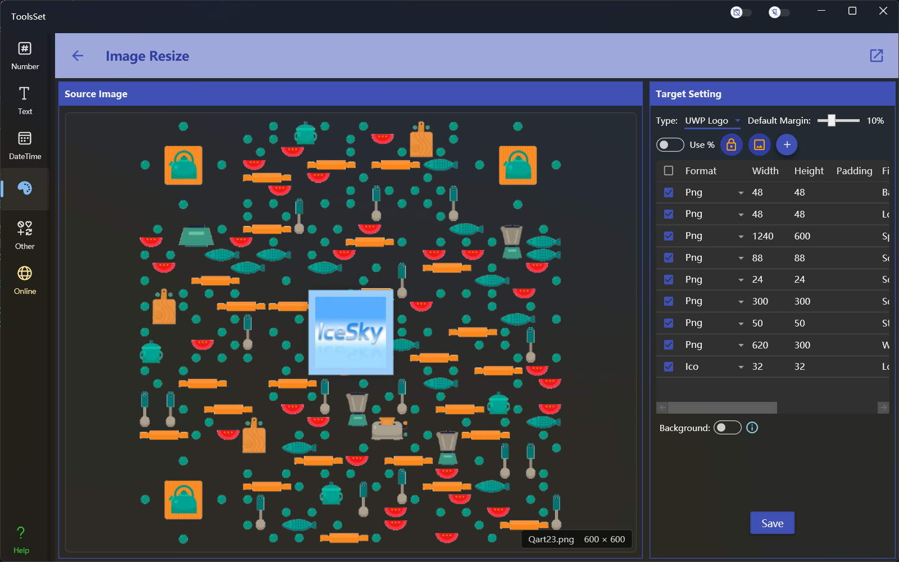

## 介绍

可以批量对图片格式和尺寸进行调整转换

## 使用方法

* 点击左侧区域打开图片文件，打开后会显示图片预览
* 右侧可以设置转换目标参数其中包括：
  * 转换类型：下拉框包含自定义列表和多种预定义类型，选择自定义列表选项可以自己指定转换目标，每种预定义类型都包含多种目标格式及尺寸，选择预定义类型后下方列表内容会自动更新
  * 默认边距：进行转换时使用的默认边距，如果在下方列表中没有设置边距将使用此默认边距，默认边距为百分比数值，将对列表中所有未设置边距的项目起作用，默认为10%，最大值为30%
  * 使用比例：开关打开后列表中的项目将使用比例缩放方式，否则使用像素尺寸方式进行调整
  * 锁定比例：在比例开关关闭时有效，打开后在调整尺寸时将锁定图片宽高比，否则会对图片进行拉伸
  * 拉伸填充：在比例开关关闭时有效，打开后在调整尺寸时将对图片进行拉伸以覆盖目标尺寸
  * 转换列表：下方列表中可以定义多个目标转换格式和尺寸，可以使用像素方式或比例方式设置尺寸。目标格式中第一个默认选项为【不改变】，表示只修改尺寸而不改变图片格式。列表中也可以自定义转换结果的文件名称，此文件名不用加后缀。
    > 列表中的项目可以通过列表上方的添加按钮进行添加，但是不能删除，切换转换类型可以将列表恢复初始状态

    > 自定义列表和预定义列表都可以自行添加或修改项目

    > 转换时只会转换列表中选择的并且尺寸大于0的项目，文件名相同的项目将会自动重命名
  * 背景色：列表下方的开关用于设置转换结果的背景色，开关关闭时表示使用透明背景，透明背景只对png格式有效；开关打开后可以指定图片的背景颜色。
* 点击保存按钮将会打开文件夹选择窗口选择目标路径，确定后将按列表中的文件名称保存结果
  