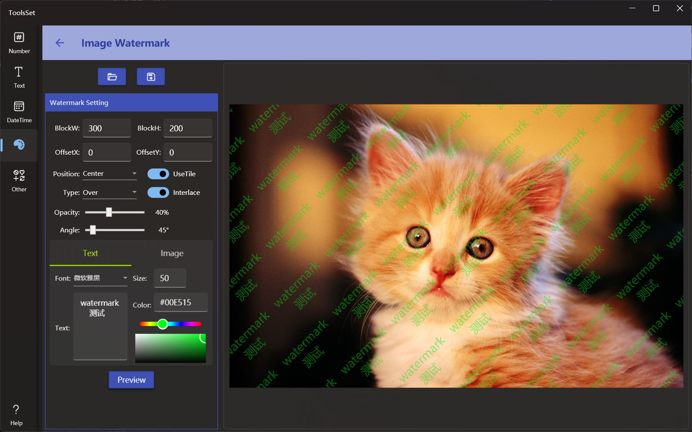

## 介绍

水印添加工具，可以打开图片添加文本或图片水印，可以指定水印大小、间隔、透明度、角度、叠加效果，以及是否平铺等

## 使用方法

* 添加图片：点击上方打开文件按钮打开要添加水印的图片文件，文件打开后会显示在右侧预览区
* 水印参数设置
  * BlockW、BlockH：用于设置水印块的大小，此设置将影响水印平铺时的间距
  * OffsetX、OffsetY：用于设置水印在横竖方向的偏移量，此偏移和水印位置设置有关
  * Position：用于设置水印相对于图片的位置，水印平铺时设置无效
  * Type：设置水印叠加时的混合效果
  * UseTile：开启后可以将水印平铺填满图片
  * Interlace：平铺方式打开后可用，用于指定是否使用交错方式排列，开启后水印在奇偶行将错开半个水印宽度排列
  * Opacity：设置水印的不透明度，0为全透明
  * Angle：设置水印的旋转角度
* 水印内容设置
  * 文本水印：在下方选择Text选项卡，可用给图片添加文本水印
    * 文本水印可以设置字体、字号、文本内容及颜色
  * 图片水印：在下方选择Image选项卡，可用给图片添加图片水印
    * Width、Height用于设置图片水印的宽度和高度
    * 点击下方区域可以从打开文件对话框选择水印图片
* 生成水印：点击下方的【Preview】按钮可以在右侧生成水印预览
* 保存图片：点击上方的保存按钮可以将生成的结果保存到文件
  