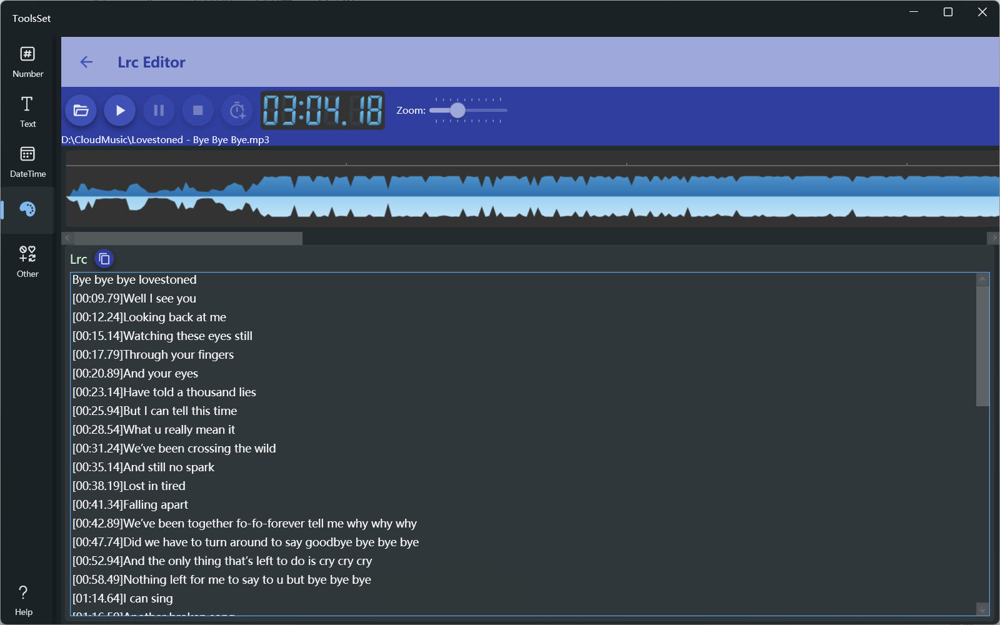

## 介绍

显示音乐频谱，点击按钮快速插入时间标记

## 使用方法

* 点击打开文件按钮打开MP3文件，文件打开后下方即可显示音乐频谱
* 使用右侧的三个按钮进行播放控制，依次为：播放、暂停、停止
* 最右侧的滑动条可以对频谱进行缩放
* 在下方Lrc文本框中输入歌词内容，点击上方的插入时间按钮即可快速在光标所在行开头插入时间
  > 时间插入后光标会自动移动到下一行开头，可以实现连续插入
  