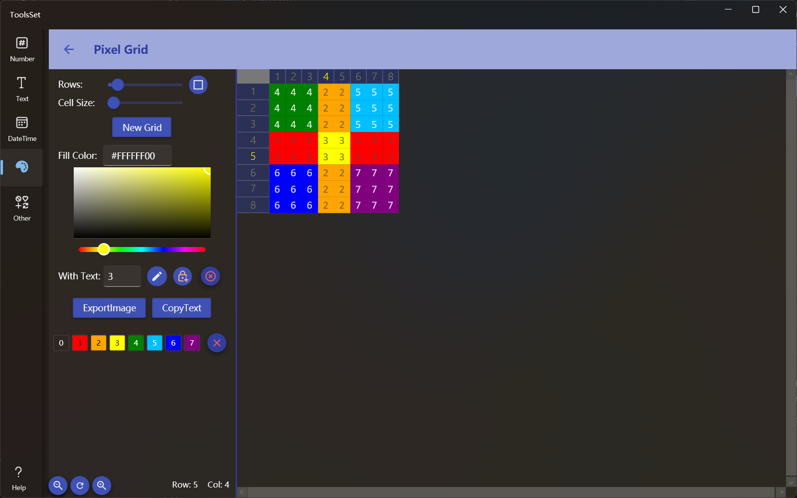

## 介绍

使用网格绘制像素图，可以锁定颜色、填充文本、缩放网格，支持导出图片及复制文本

## 使用方法

左侧为设置区域，右侧为绘制区域

* 工具打开时默认创建了8x8的网格，可以通过左侧设置修改
  * 通过Rows滑动条调整网格数量，范围为4~64，调整时行列会同时修改，如果需要行列数量不一样，可以点击右侧按钮切换模式，切换之后可以分别设置行数和列数
  * 通过Cell Size滑动条设置网格尺寸，范围为20~50，此设置会影响到导出图片时的像素大小
  * 修改数量和尺寸后点击【New Grid】可以创建一个新的网格
* 设置颜色有三种方式
  1. 在Fill Color文本框输入16进制的颜色值
  2. 使用颜色选择器选择
  3. 点击下方预定义颜色选择
* 可以在With Text的文本框中输入字符，在绘制的同时填充到网格
* 文本输入右侧的三个按钮的作用分别是：切换绘制和清除、锁定颜色、清除所有绘制
  > 鼠标按下并拖动可以连续绘制或清除 
  >
  > 锁定颜色开启后在绘制和清除状态下有不同的作用
  > * 绘制状态下将锁定已经填充颜色的区域使其不会被填充
  > * 清除状态下将锁定只清除与鼠标点击时相同的颜色，其他颜色不会清除
* 点击【ExportImage】按钮可以将绘制的图案导出为图片文件
* 点击【CopyText】按钮可以复制网格中填充的文本
* 绘制时每使用一种新的颜色就会在最下方记录颜色历史，从而可以快速的重新使用其绘制，颜色历史可以通过点击预定义颜色右侧的按钮清空
* 左侧最下方三个按钮可用于对右侧网格的缩放和重置显示，此缩放不会影响最终导出的图片文件