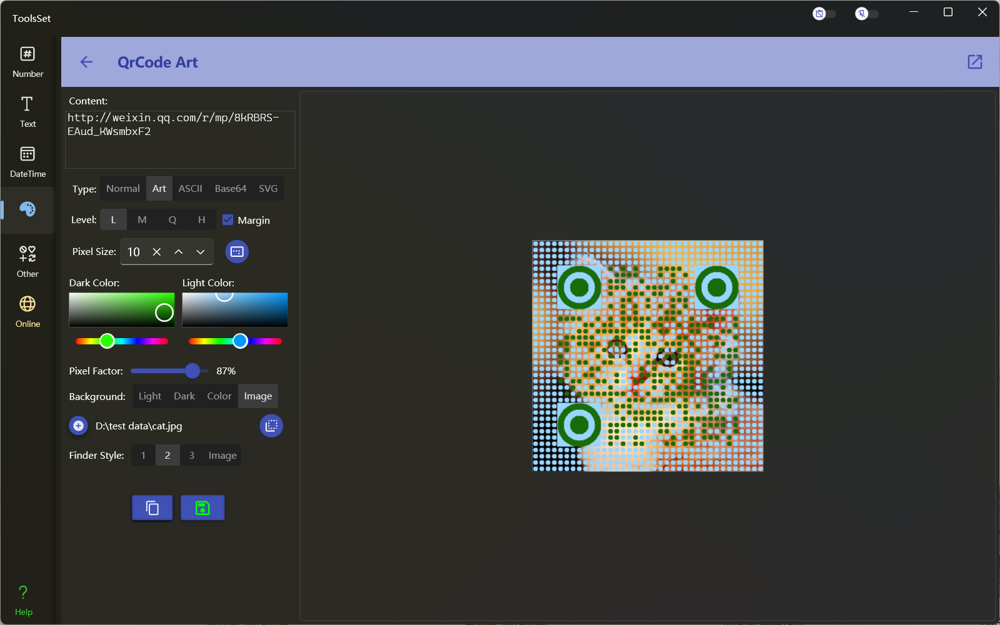
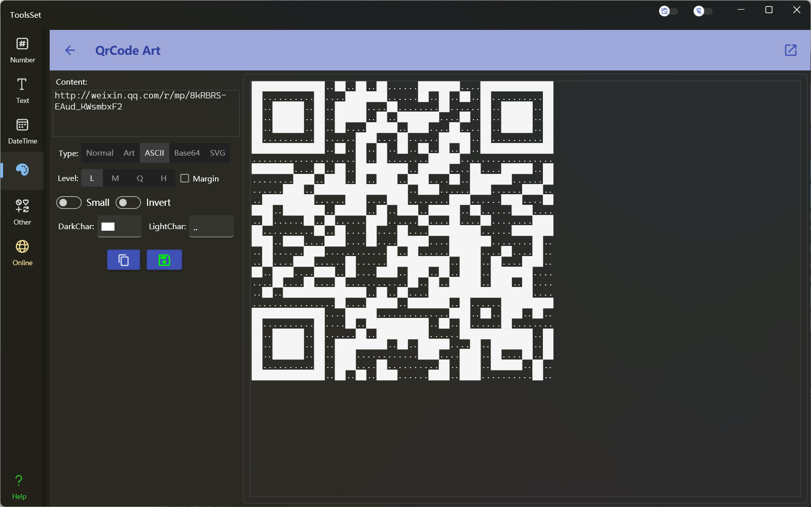

## 介绍

二维码生成工具，可以生成常规二维码、艺术二维码、ASCII文本二维码，以及Base64和SVG格式

## 使用方法

* 设置内容：在左侧上方文本框中输入待转换的文本内容
* 选择生成类型：文本框下方可以选择二维码生成类型，依次为：Normal（常规二维码）、Art（艺术二维码）、ASCII（文本二维码）、Base64、SVG

* 参数设置：类型设置下方为参数设置，前两行为通用参数，之后的参数根据不同类型有所差别
  * 通用参数：
    * Level：指定容错级别， L（低）：7%，M（中）：15%，Q（较高）：25%，H（高）：30%
    * Margin：指定结果是否包含边距
    * Pixel Size：指定二维码中的像素尺寸，范围为1~50，默认为10
  
  * 类型参数：
    * 常规二维码可以指定的参数包括：
      * 是否带Logo，选中后可以在二维码中间添加Logo图片
      * 二维码颜色，可以设置深色和浅色部分的颜色
      * Logo设置，选中带Logo后可以设置Logo图片、尺寸、边框、背景色
    * 艺术二维码可以指定的参数包括：
      * 二维码颜色，可以设置深色和浅色部分的颜色
      * 像素比例，设置像素圆点的尺寸比例，比例越小镂空越多
      * 背景可以设置镂空区显示内容，可以指定为二维码的深色或浅色部分颜色、自定义颜色、图片，选择图片后可以设置图片是否扩展到边距区域
        
        > 开启边距后可以设置边距是否以圆点显示，开启圆点显示后才会在边距部分显示出背景颜色或图片
      * 定位点样式，可以选择预定义样式或图片  

  

    * ASCII文本二维码可以指定的参数包括：
      * 显示字符：可以设置深色和浅色部分的显示字符
      * Small：选中后会生成尺寸更小的文本二维码，此时不能指定显示字符
      * Invert：反转深色和浅色部分的显示字符
    
  

    * Base64可以指定的参数包括：
      * 二维码颜色，可以设置深色和浅色部分的颜色
    * SVG可以指定的参数包括：
      * 是否带Logo，选中后可以在二维码中间添加Logo图片
      * 二维码颜色，可以设置深色和浅色部分的颜色
      * Logo设置，选中带Logo后可以设置Logo图片和尺寸

* 复制或保存结果：左侧最下方为结果操作按钮，分别为复制和保存，在类型不同时有所不同
  * 类型为常规和艺术二维码时，生成结果为图片，所以复制和保存的都是图片格式
  * 类型为ASCII和Base64时，生成结果为文本，所以复制和保存的都是文本格式
  * 类型为SVG时，生成结果为文本，复制的是SVG文本内容，保存时为SVG格式文件
  