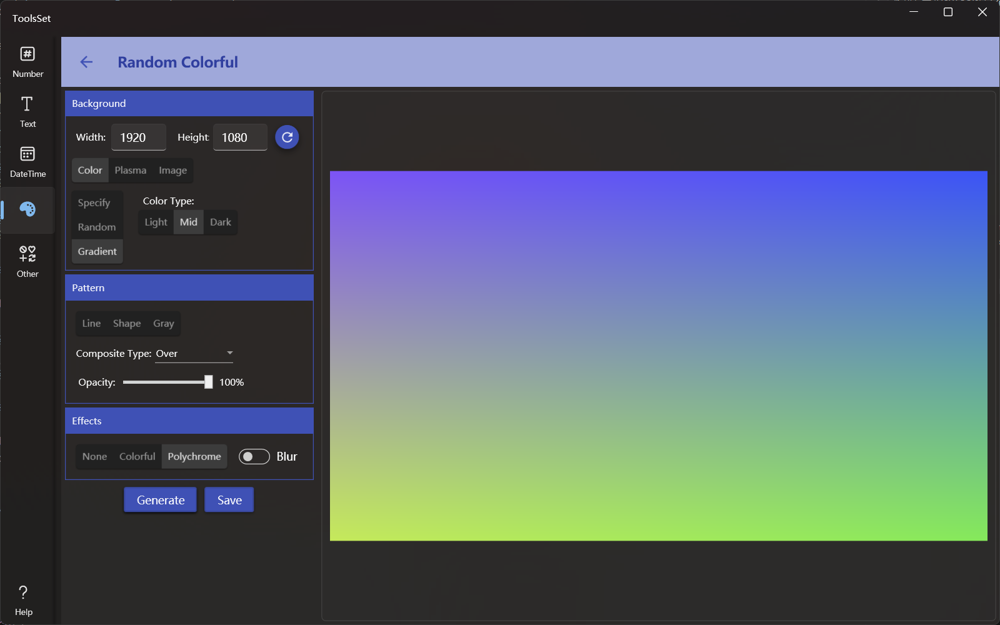

## 介绍

随机色彩生成工具，可以用来生成单色、渐变色或随机颜色的背景图片或给图片添加颜色滤镜

可以生成随机纯色、两色渐变、指定颜色，也可以指定等离子体效果和图片，支持添加图案和色彩特效，可以将生成的图片保存到文件

## 使用方法

* 选择基础背景，基础背景提供三个选择
  * 颜色：选择颜色后可以继续选择指定颜色、随机颜色和渐变色中的一种，随机颜色和渐变色可以选择亮色、中间色和暗色
  * 等离子体：选择等离子体后可以选择等离子体、分形和等离子分形三种效果
    > 等离子体效果生成稍慢 
  * 图片：选择图片后可以打开本地图片文件
* 添加图案
  * 在添加图案部分可以选择图案类型：直线、图案、灰色调
    * 线：可以选择不同方向和角度的直线或锯齿
    * 图案：可以选择不同形状的网格图案
    * 灰色调：可以选择不同比例的点状图案
  * 可以选择不同的叠加效果
  * 可以指定图案的透明度
* 添加特效
  * 特效选项包含：无、颜色、多色模式
    * 无：不会添加颜色效果
    * 颜色：会添加一种渐变的颜色效果
      > 如果背景选中指定颜色，则添加的颜色会使相同色相的颜色，最后结果也会是同一色调 
    * 多色：会添加多种颜色效果
  * 可以指定是否添加模糊效果
    > 开启模糊效果后生成稍慢 
* 点击下方【Generate】按钮可以根据设置在右侧预览区生成一种颜色或图片  
* 点击【Save】可以将颜色或图片保存到文件