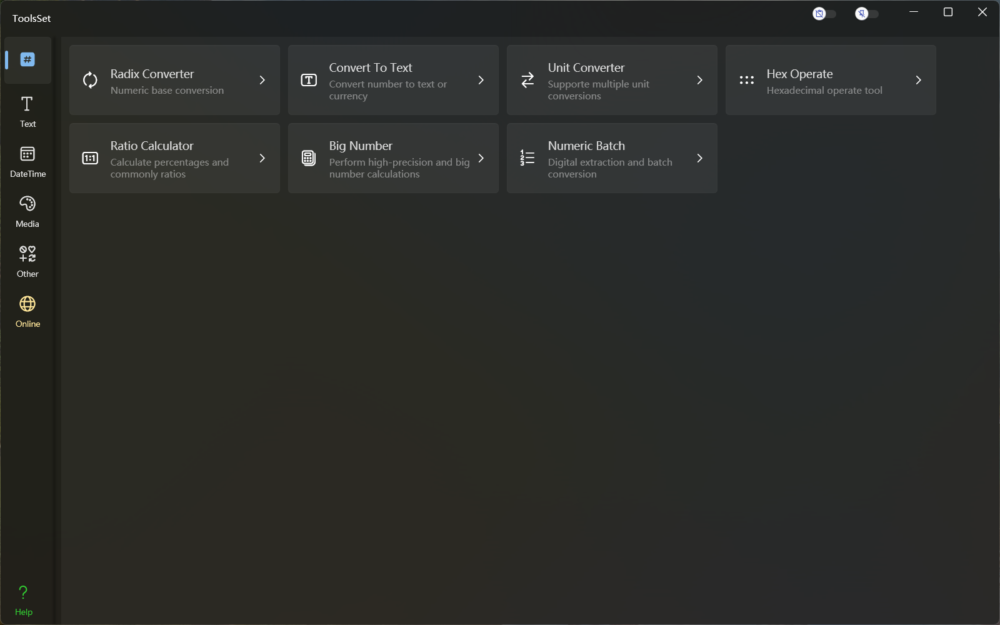

## 介绍

功能包括：Radix Converter、Convert To Text、Unit Converter、Hex Operate、Ratio Calculator、Big Number

## 功能列表

### Radix Converter *进制转换*
* 整数 Integer （13种）
  * 十进制 -> 十六进制
  * 十进制 -> 八进制
  * 十进制 -> 二进制
  * 十六进制 -> 十进制
  * 十六进制 -> 八进制
  * 十六进制 -> 二进制
  * 八进制 -> 十进制
  * 八进制 -> 十六进制
  * 八进制 -> 二进制
  * 二进制 -> 十进制
  * 二进制 -> 十六进制
  * 二进制 -> 八进制
  * 十进制 -> 任意进制文本

* 浮点数 Float （4种）
  * 十进制 -> 十六进制
  * 十进制 -> 二进制
  * 十六进制 -> 十进制
  * 十六进制 -> 二进制

* 双精度 Double （4种）
  * 十进制 -> 十六进制
  * 十进制 -> 二进制
  * 十六进制 -> 十进制
  * 十六进制 -> 二进制

### Convert To Text *数字和文本互转*
* 中文转换 （12种）
  * 十进制数字 -> 中文数字小写
  * 十进制数字 -> 中文数字大写
  * 十进制数字 -> 中文序号小写
  * 十进制数字 -> 中文序号大写
  * 十进制数字 -> 中文货币小写
  * 十进制数字 -> 中文货币大写
  
  * 中文数字小写 -> 十进制数字
  * 中文数字小写 -> 中文数字大写
  * 中文序号小写 -> 十进制数字
  * 中文序号小写 -> 中文序号大写
  * 中文货币小写 -> 十进制数字
  * 中文货币小写 -> 中文货币大写
* 其他国家文本
  * 数字文本 （10种）
    * 英语 en
    * 波兰语 pl
    * 西班牙语 es
    * 法语 fr
    * 俄语 ru
    * 土耳其语 tr
    * 乌克兰语 ua
    * 保加利亚语 bg
    * 阿姆哈拉语 am
    * 葡萄牙语 pt
  * 货币文本 （7种）
    * 美元 USD
    * 欧元 EUR
    * 俄罗斯卢布 RUB
    * 土耳其里拉 TRY
    * 格里夫尼亚 UAH
    * 埃塞俄比亚比尔 ETB
    * 兹罗提 PLN
* 符号转换
  * 整数 -> 19种预定义字符
  * 整数 -> 自定义字符

### Unit Converter *单位转换*
* 指定类别 （79种）
* 类别检索

### Hex Operate *十六进制操作*
* 十六进制转二进制
* 高低位交换
* 按位运算
  * 格式支持十六进制、十进制、二进制
  * 单一操作数运算：取反、左移、右移（带符号及不带符号）
  * 两个操作数运算：与、或、异或、同或、与非、或非
* 获取位范围值

### Ratio Calculator *比例计算器*
* 比例运算
  * 比值计算
  * 增量计算
* 小数转分数
* 分数化简
* 等比运算
* 分数比较

### Big Number *大数计算*
* 数学运算
  * 四则运算
  * 乘方开方
  * 最大公约数
  * 最小公倍数
* 结果显示
  * 常规方式
  * 科学计数法
  * 指定小数位数
* 随机数
  * 指定整数位数
  * 指定小数位数
* 获取Pi的小数位数

### Numeric Batch *数值批量处理*
* 数值提取
  * 整数提取
  * 实数提取
  * 十六进制提取
* 数值格式化
  * 十进制指定格式字符串
  * 十六进制字节数组大小写、有无分隔、倒序
* 数值转换
  * 十进制转二进制、中文、十六进制字节数组
  * 字节数组转其他类型