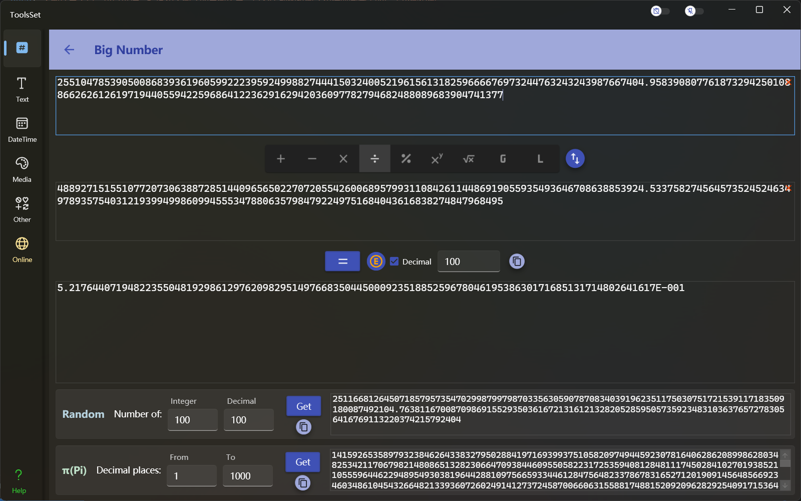

## 介绍

此工具支持高精度和大数字的算数运算，还可以生成指定整数位数和小数位数的数字，以及获取圆周率小数点后的指定范围的数字

## 使用方法

* 算数运算
  在上方两个文本框中输入数值，然后在中间选择运算类型，之后点击【=】按钮即可在下方获取结果，计算结果最大位数约为3000。运算类型包括：
  1. 四则运算
     * 操作数支持不限长度的数字 
     * 除法运算中除数不能为0
  2. 求模
     * 两个操作数必须为整数 
  3. 乘方
     * 第一操作数支持不限长度的数字 
     * 第二操作数必须为小于10000的整数
  4. 开方
     * 两个操作数必须为正整数 
     * 第二操作数必须小于255
  5. 最大公约数
     * 两个操作数必须为正整数 
  6. 最小公倍数
     * 两个操作数必须为正整数 
  > 运算类型最右侧的按钮用于交换两个操作数
* 随机数字
  * 在随机数区域输入整数部分和小数部分的位数后，点击右侧的【Get】按钮，即可在右侧生成对应的数字，位数最大可以指定9999
* 获取圆周率
  * 在圆周率区域输入起始位数和结束位数后，点击右侧的【Get】按钮，即可在右侧生成圆周率中对应的区域位数的数字
  > 位数最大可以指定99999，每次获取支持的最大范围为10000位

> 此工具的结果可以点击复制按钮进行快速复制