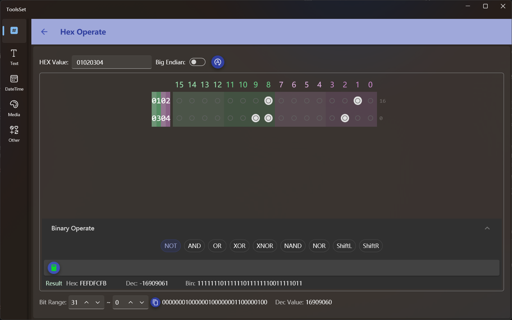

## 介绍

此工具用于十六进制数据操作，可以将其转换为二进制进行操作，支持二进制位运算及逻辑运算 

## 使用方法

* 操作数设置：在上方文本框可以输入十六进制数字，右侧为字节序开关，开关打开可以将十六进制字节倒序，操作数设置好之后需要点击最右侧按钮将数值更新到下方二进制数据区
  > 输入框的数字默认为4位，转为二进制即16位，可以通过改变十六进制数据位数来改变二进制区域的位数
  >
  > 比如输入5位十六进制数，二进制区域位数即可变为32位，十六进制数据会自动填充到8位
  >
  > 输入9位十六进制数，二进制区域位数即可变为64位，十六进制数据会自动填充到16位; 同理可以减少位数
  >
  > 十六进制数据最多支持16位，即最多64位二进制位

* 二进制操作
  
  二进制区域的每个位都是一个开关，通过打开和关闭可以将对应位值设置为1或0
  > 打开或关闭开关时对值的修改会自动同步到上方十六进制数据和最下方的位范围数据中
* 逻辑运算
  
  二进制区域下方是逻辑运算区，可以进行按位逻辑操作。此区域默认没有展开，需要操作时可以点击区域标题栏切换

  此区域可以执行的操作包括：
  * 单一操作数运算
    * 取反（NOT）：对二进制数据按位取反
      > 点击最上方的更新数据按钮可以自动更新值，如果修改了二进制的位，则需要点击此区域的计算按钮重新计算值
    * 左移（ShiftL）：对二进制数据按位左移，通过滑动条进行操作，数据范围和当前数据的二进制位数一致
    * 右移（ShiftR）：对二进制数据按位右移，操作方式和左移一致
      > 右移时可以通过右侧开关选择是否带符号，默认为打开=带符号右移
  * 两个操作数运算
    * 与（AND）
    * 或（OR）：
    * 异或（XOR）
    * 同或（XNOR）
    * 与非（NAND）
    * 或非（NOR）
    > 这组操作方式都一样，先点击按钮选择要进行的运算，然后设置第二个操作数，之后点击计算按钮即可得到结果
    >
    > 第二个操作数的输入方式有三种：十六进制、十进制、二进制，十六进制和十进制直接输入符合格式的数值即可
    >
    > 二进制输入为一组开关按钮，可以通过改变数据位数来增加或减少二进制位数量
    >
    > 这三种进制的数据会自动进行转换，即修改一个的值其他进制的值将自动修改

* 获取位范围值
  
  最下方区域可以按位获取所选范围的值，默认位全部位，可以通过修改起始位和结束位获取其中的一部分

  起始位和结束位可以互换，交换后获取的位也将反序

  可以点击中间的复制按钮复制截取的二进制数据
