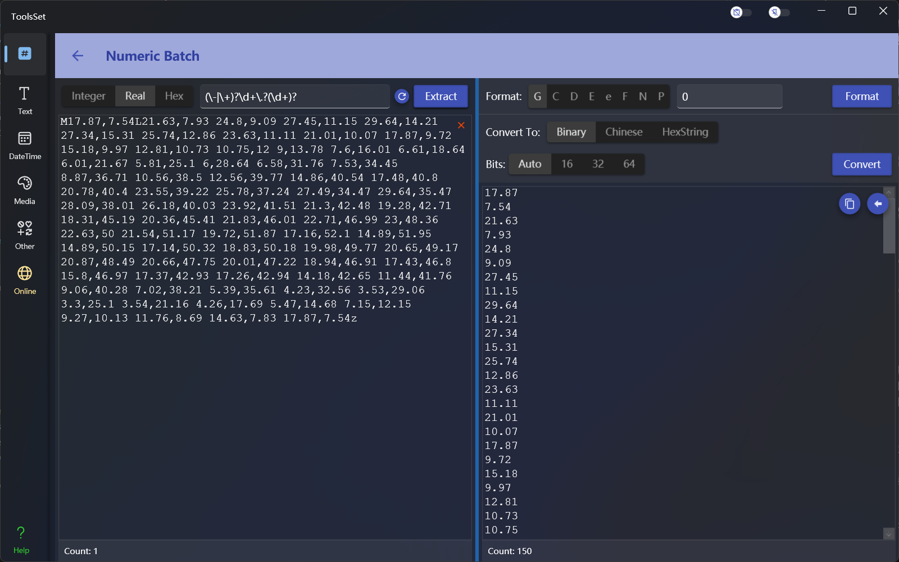
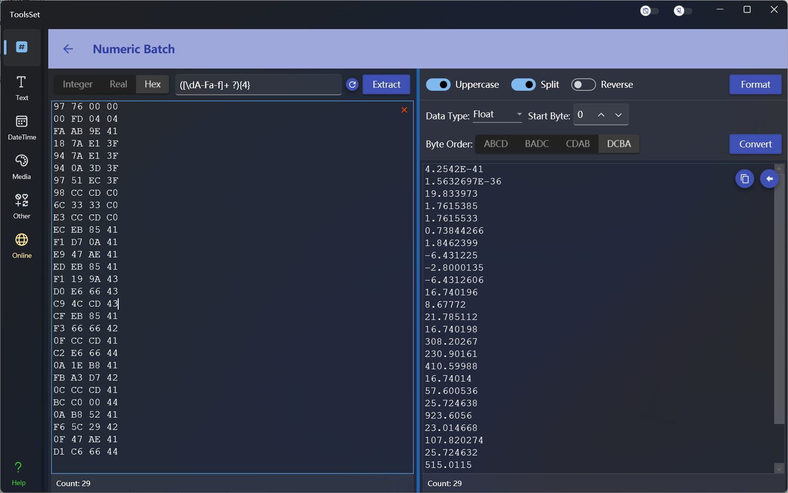

## 介绍

此工具可以从字符串中通过正则表达式提取整数、实数和十六进制数值，批量进行数值格式化和各种转换。

## 使用方法

* 数值提取
  在左侧上方工具栏可以选择操作类型，分为整数、实数和十六进制操作，类型右侧文本框用于输入提取内容的正则表达式，下方文本框输入包含数值的字符串后点击右侧【Extract】按钮执行提取，匹配正则表达式的数据将分行显示在右侧下方的结果文本框中。
* 数值格式化
  * 左侧选择整数或实数可以进行十进制数值格式化处理
    * 标准格式化
      
      右侧上方可以选择的标准格式化方式，选择后会自动显示在右侧文本框中，可在后面添加数字。
      选项包括：
      1. G：常规格式说明符，可以后接数字表示有效位数
      2. C：货币格式说明符，会自动添加货币符号，可以后接数字表示小数位数，默认2位
      3. D：十进制格式说明符，仅限整数，可以后接数字表示数字下限，位数少于数字下限会在前面补0
      4. E：指数格式说明符，可以后接数字表示小数位数，默认6位，可以使用小写e使结果小写
      5. F：定点格式说明符，可以后接数字表示小数位数，默认2位
      6. N：数字格式说明符，会自动添加组分隔符，可以后接数字表示小数位数，默认2位
      7. P：百分比格式说明符，数字乘以 100 并以百分比符号显示，会自动添加组分隔符，可以后接数字表示小数位数，默认2位
      8. X：十六进制格式说明符，仅限整数，可以后接数字表示数字下限，位数少于数字下限会在前面补0，可以使用小写x使结果小写
    * 自定义格式化

      标准格式化右侧的文本框可以输入自定义的格式化字符串，可以使用的格式说明符包括：
      1. 0：零占位符，用对应的数字（如果存在）替换零；否则，将在结果字符串中显示零。
      2. \#：数字占位符，用对应的数字（如果存在）替换“#”符号；否则，不会在结果字符串中显示任何数字。如果相应数字是无意义的 0，则在结果字符串中不会出现任何数字。
      3. .：小数点，确定小数点分隔符在结果字符串中的位置。
      4. ,：组分隔符和数字比例换算，作为数字比例换算说明符时，对于每个指定的逗号，它将数字除以 1000。
      5. %：百分比占位符，将数字乘以 100，并在结果字符串中插入本地化的百分比符号。
      6. ‰：千分比占位符，将数字乘以 1000，并在结果字符串中插入本地化的千分比符号。
      7. E0：指数表示法，跟在“E”或“e”字符后面的零的数目确定指数中的最小位数。（如果格式字符串只包含E和数字则为标准格式化）
      8. \\：转义符，使下一个字符被解释为文本而不是自定义格式说明符。
      9. ;：部分分隔符，通过分隔格式字符串定义正数、负数和零各部分。
      10. 其他字符串：文本字符串分隔符，指示应复制到未更改的结果字符串的字符。
  * 左侧选择十六进制可以对字节数组进行格式化处理，选项包括
    * 大小写：打开后结果将转为大写字符，否则为小写
    * 分隔：打开后结果将按字节以空格分隔，否则不分隔
    * 倒序：打开后结果将按字节倒序
  

* 数值转换
  * 左侧选择整数或实数可以进行十进制数值转换
    * 转为二进制
  
      二进制可以选择结果显示位数，自动将会根据数据格式自动进行位数转换，其他选项将会补足到指定位数。
    * 转为中文
      
      中文转换支持中文数字、中文金额、中文序号表示法，可以选中大写将结果转换为中文大写汉字。
    * 转为十六进制

      十六进制转换将数字转换为十六进制的字节数组，可以指定字节顺序
  * 左侧选择十六进制可以对字节数组进行转换，选项包括：
    * 数据类型：可以选择不同的数据类型
    * 开始字节：设置转换时开始的字节位置
    * 字节序：设置转换时字节使用的排列方式

> 右侧结果可以点击复制按钮进行快速复制
> 
> 点击左箭头按钮可以快速复制到左侧进行下一步操作