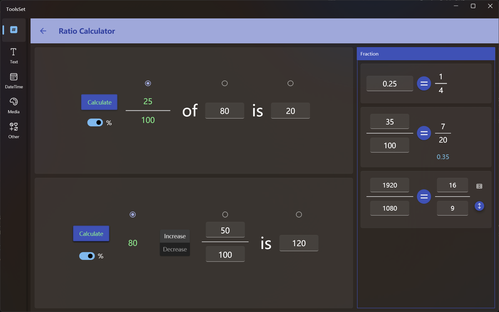

## 介绍

此工具可以进行各种比例计算、计算增长率、分数化简、小数转分数、等比运算等

## 使用方法

* 比例计算
  生活中经常碰到一个问题：某个数的百分之几或几分之几是多少，如果把其中的三个数字用A、B、C表示，此问题可以描述为：A的B是C，即 B of A is C

  左侧上方为比例计算工具，可以通过这个问题中已知的其中两个值而计算出第三个值，输入方法分别如下：
  1. 计算A：选择第二个单选按钮，中间的文本框变为不可用状态，输入第一个比例和第三个结果，点击左侧【Calculate】按钮即可计算出结果
  2. 计算B：选择第一个单选按钮，左侧的文本框变为不可用状态，输入第二个值和第三个结果，点击左侧【Calculate】按钮即可计算出结果
  3. 计算C：选择第三个单选按钮，右侧的文本框变为不可用状态，输入第一个比例和第二个值，点击左侧【Calculate】按钮即可计算出结果
   
  > 可以打开左侧%开关，将分数的分母固定为100
  >
  > 计算比例时如果%开关没有打开，则会自动对结果化简得到最简分数
* 增长率计算
  
  左侧下方为增长率计算工具，用于解决类似”A增长/减少B是C“这种问题，操作方法和比例计算类似，通过中间的两个按钮选择增长还是减少
* 小数转分数
  
  右侧上方为小数转分数工具，在文本框输入一个数字，点击【=】按钮即可得到此数字的最简分数
* 分数化简

  右侧中间为分数化简工具，在左侧输入要化简的分数，点击【=】按钮即可得到此数字的最简分数，下方会显示此分数对应的小数
* 等比运算
   
  右侧下方为等比运算工具，【=】左右为两个值相等的分数，可以输入其中三个计算最后一个值

  最右侧有两个按钮，上方的可用于选择常用比例，点击下方按钮可以将右侧分数的分子分母交换 

>! 此工具的所有输入框都可以输入小数
>
> 所有运算结果最多保留4位小数