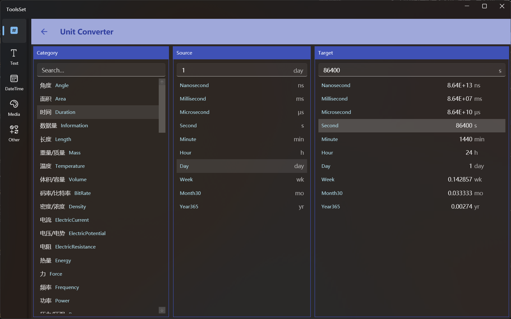

## 介绍

此工具支持数十种数理化单位转换，包括常用的：角度、面积、时间、长度、质量、温度、体积、数据量等

## 使用方法

1. 选择单位类型：在左侧列表中选择准备转换的单位类型
   > 可以在列表上方的文本框输入类型名称来快速查找，支持中文和英文名称的模糊匹配
2. 选择待转换单位：在中间列表中选择要转换的源单位
3. 输入数量：在中间的文本框输入数值
4. 查看目标数量：右侧列表会显示指定数量单位转换后的所有单位数量，可以选择其中任意项查看

> 选择一个目标单位后，对应值会显示到上方的文本框中，这时可以选择文本后进行复制