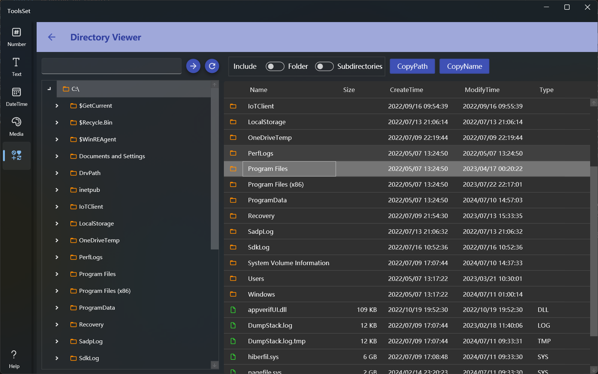

## 介绍

查看指定目录的子目录和文件，提供复制目录和文件路径及名称功能，支持选择是否包含子目录选项

## 使用方法

* 选择路径：可以在左侧上方文本框输入路径后点击箭头按钮跳转到指定路径，或者通过下方树形目录中选择路径
  > 点击跳转路径右侧的按钮可以返回根目录

* 查看内容：在左侧树形目录上双击目录节点可以切换展开折叠状态，点击树形目录的箭头图标可以在不选择目录的同时切换目录展开折叠状态。路径选择后右侧会显示选择路径包含的子目录及文件信息，包括：名称、文件大小、创建时间、修改时间、文件类型。可以双击某个文件夹查看其内容。
  > 无法访问的系统目录会显示空文件

* 复制路径或名称：有两种方式复制路径或名称

  1. 鼠标右键操作：在右侧列表选择的目录或文件上点击鼠标右键会弹出菜单，选择复制路径或名称，可以复制选择的目录和文件的路径或名称
     > 上方工具栏的文件夹选项和包含子目录选项设置无效，操作只会对当前选择的目录及文件进行

  2. 按钮操作：使用上方工具栏的按钮进行操作时，文件夹选项和包含子目录选项可以生效。默认会复制所有文件的路径或名称
     * 文件夹选项关闭时，将仅复制文件路径或名称，打开时会复制文件和目录
     * 子目录选项关闭时，将仅复制当前目录的路径或文件名称，打开后会复制所有子目录下的路径和文件名称
     
     > 未选择目录和文件时的操作对象为左侧树形目录选择的路径

     >! 打开包含子目录选项后，如果目录过多会提示出错
  