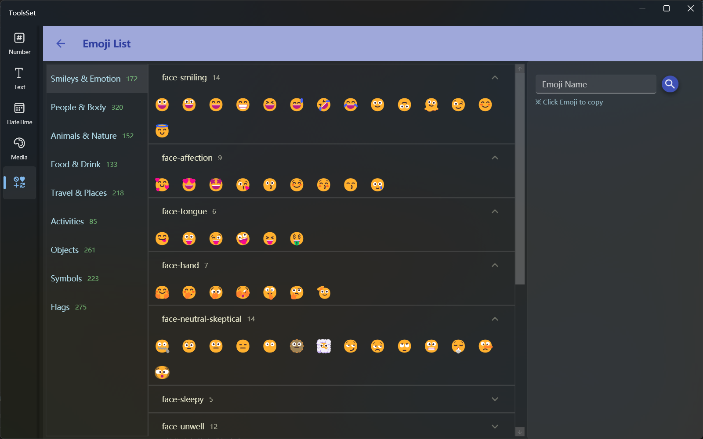

## 介绍

包含1800多个Emoji，支持按分类查看、按名称搜索及复制Emoji

## 使用方法

左侧为分类列表，选择分类后中间会展示子分类

子分类可以通过点击标题行切换展开状态，展开后可以查看其中包括的所有Emoji

鼠标悬停到Emoji上可以查看名称及大图标，点击Emoji可以将其复制到剪贴板

可以在右侧文本框输入名称后点击按钮进行搜索，搜索结果会显示在下方，可以点击Emoji进行复制
