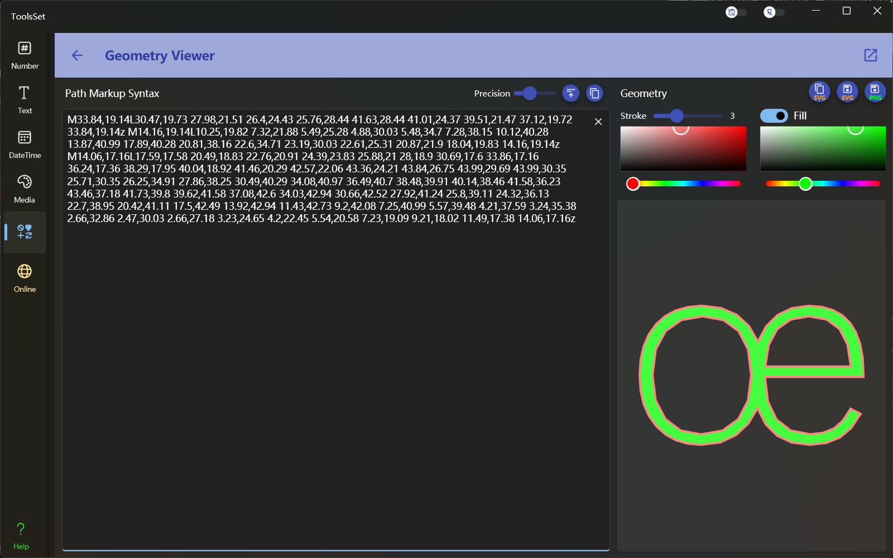

## 介绍

几何路径代码查看工具，可以将几何路径代码转换为图形显示，可以简化路径、指定显示边框及填充参数，支持复制svg字符串及保存svg和png文件

## 使用方法

* 编辑路径：在左侧文本框中输入几何路径代码，如果代码有误会在下方提示错误信息
* 简化路径：左侧上方右端可以设置路径坐标的精度，使用活动条设置精度后点击右侧按钮可以更新文本框中的内容，最右侧的按钮可以快速复制文本内容
* 路径设置：右侧上方可以设置显示路径的参数，包括边框宽度、边框颜色、是否填充，开启填充后可以设置填充颜色
* 保存结果：右侧上方的三个按钮可以对设置结果进行操作，依次为：复制SVG字符串、保存SVG文件、保存PNG文件
