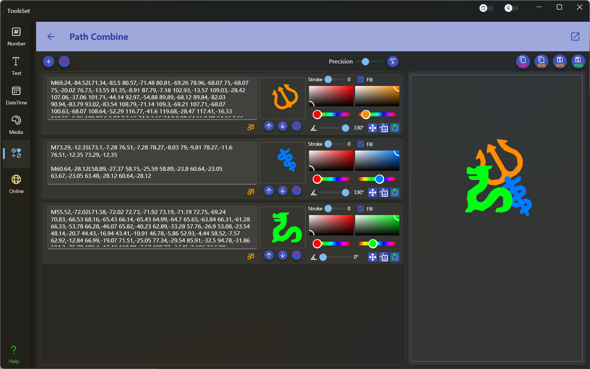

## 介绍

将多个几何路径组合成一个，支持路径旋转、平移、缩放及自定义颜色，可以复制结果路径及svg文本，支持保存为svg和png文件

## 使用方法
* 路径操作：左侧上方工具栏可以对全局路径进行操作
  * 添加路径：点击工具栏左侧【+】按钮可以在下方添加一个空白的路径栏
  * 清空路径：点击第二个【x】按钮可以清空下方所有的路径栏
  * 简化路径：工具栏右侧的滑动条可以设置所有路径的坐标精度，精度设置好后点击右侧按钮可以执行简化操作
  
    > ⚠️ 执行简化路径操作会修改所有路径的文本内容，并将所有内容改变的路径的变换效果清除

* 路径设置：左侧下方路径栏列表中可以对单个路径进行编辑和设置
  * 编辑路径：在文本框中输内容可以编辑该路径，如果路径格式有误，下方会出现错误提示
  
    > ⚠️ 编辑路径会清除其变换效果
  * 调整比例：文本框下方右侧按钮点击后可以打开比例调整菜单，用于某些路径坐标过大或过小时进行比例调整
    > \>1 的项点击后将执行放大操作，<1 的项点击后将执行缩小操作
    > 
    > ⚠️ 此操作会改变路径文本内容，并清除路径的变换效果，如果做过路径简化也会失效需要重新进行简化操作
    > 
    > 可以使用菜单多次进行比例调整，来达到最终合适的尺寸
  * 调整层级：列表中路径的排列顺序决定了组合时的层叠顺序，排在下方的路径将显示在结果的上层。
    
    中间上方显示了一个路径的预览，预览图下边的三个按钮的作用分别为：
    * 上移一行：点击后此路径将会向上移动一行，结果中的此路径将向下一层，处于第一行时点击无效
    * 下移一行：点击后此路径将会向下移动一行，结果中的此路径将向上一层，处于最后一行时点击无效
    * 删除此行：点击后将把此路径从列表中移除
  
  * 设置边框及填充：右侧上方可以设置路径的边框和填充效果，可以设置的内容包括：
    * 边框宽度：通过滑动条进行设置，设置为0时没有边框，最大值为10
    * 边框颜色：左侧的颜色选择器可以选择边框颜色
    * 是否填充：复选框可以设置路径是否填充，选中后可以选择填充颜色，否则将为透明无填充
    * 填充颜色：右侧的颜色选择器可以选择路径填充的颜色，在选中填充后才会显示
  
  * 路径变换：右侧下方的可以对此行路径进行变换，从左到右的操作依次为：
    * 旋转变换：通过滑动条设置路径的旋转角度，范围为0~360
    * 平移变换：在平移图标上点击并按住拖动，可以对路径进行移动
      > ⚠️ 平移变换开始时会将起始点重置，即不会累积平移距离
    * 缩放变换：在缩放图标上点击并按住拖动，可以对路径进行等比缩放
      > ⚠️ 缩放变换开始时会将起始比例设置为1，即不会累积缩放比例
      > 
      > 缩放变换不会改变路径的原始代码，缩放范围为0.1~2且不能连续进行，所以主要用于尺寸微调，如果尺寸和预期差距过大请先使用前面的调整比例功能进行调整
    * 清除变换：点击最右侧的按钮可以清除旋转、平移和缩放变换
* 查看结果：工具右侧可以预览组合效果并对结果进行操作，右侧上方按钮的作用依次为：
  * 复制组合结果路径的几何路径代码
  * 复制组合结果转换的SVG代码
  * 保存组合结果为SVG文件
  * 保存组合结果为PNG图片