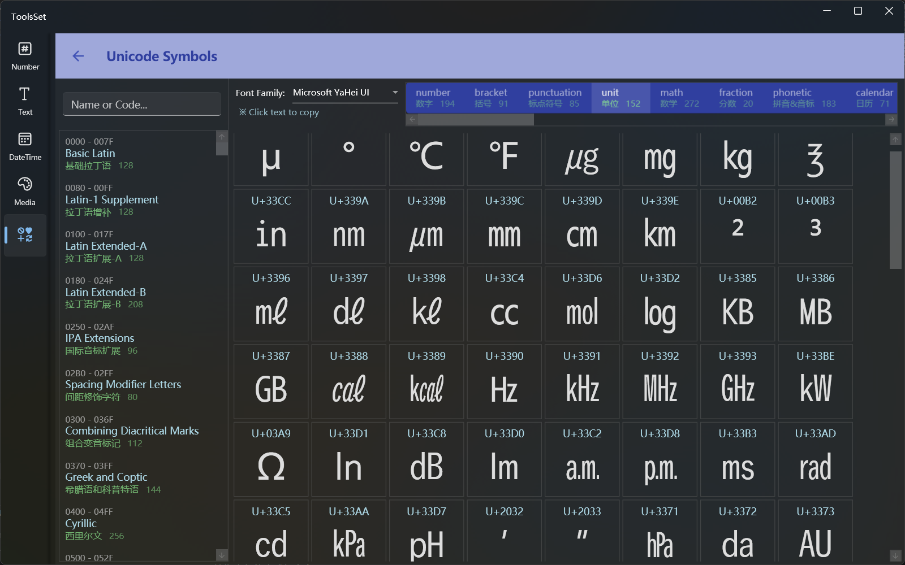

## 介绍

可以按分类查看Unicode字符，支持选择字体

## 使用方法

左侧为所有Unicode字符分类列表，包含字符编码范围为0000~1FAFF

选择一个分类后，右侧会显示此分类中的所有字符，显示信息包含编码和字符，点击字符可以将其复制到剪贴板

> 列表上方可以进行分类检索，支持按英文名称、中文名称和字符编码检索
>
> 右侧上方的字体下拉框可以选择字体，某些特殊字符只有在特定支持的字体中才能显示
>
> 右上角的水平列表列出来常用的三十多种字符分类，包括数字、括号、标点、单位、数学符号、各种形状等，选择类别后即可查看，点击字符即可复制