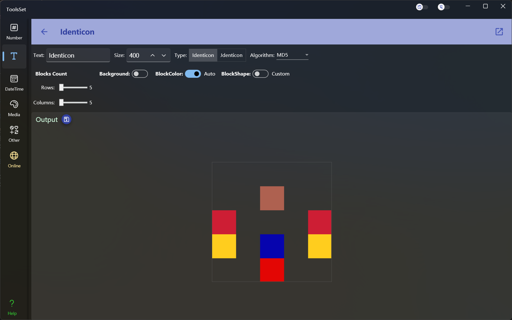
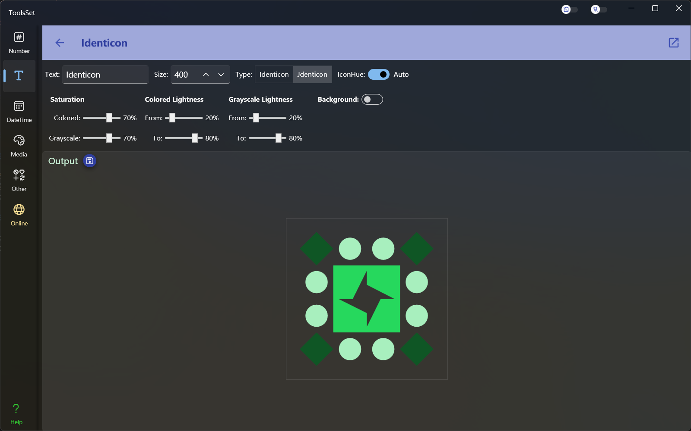

## 介绍

根据指定文本生成对应的 Identicon 或 Jdenticon 头像

## 使用方法

上方菜单栏可以输入待转换文本、输出图片尺寸、选择头像类型，文本修改后将自动生成对应的哈希头像

### Identicon 参数设置

类型选择 Identicon 可以设置其相关参数，其中包括：

* 哈希算法：用于指定转换时使用的哈希算法，可以选择：MD5、SHA1、SHA256、SHA384、SHA512
* 行列数量：用于设置生成头像时包含的行列块数量，范围为5~20
* 背景色：用于设置生成头像的背景色，开关关闭时背景透明，开关打开后可以指定背景颜色
* 前景色：用于设置生成头像中的色块的颜色，开关打开后将自动进行配色，开关关闭后可以指定色块颜色
* 色块形状：用于指定生成头像的色块形状，开关关闭时将自动选择色块形状，开关打开后可以指定包含的形状及比例，可以指定的形状包括：矩形、三角形、菱形、扇形，选中形状前的复选框后可以指定形状的比例，比例范围为0~100，数值越大包含此形状的块将越多

### Jdenticon 参数设置

类型选择 Jdenticon 可以设置其相关参数，其中包括：

* 色相：用于设置生成头像的色相，开关打开后将自动选择头像色相，否则可以指定生成头像的色相
* 饱和度：用于设置生成头像的饱和度，可以分别指定彩色和灰度色的饱和度
* 彩色亮度：用于设置彩色部分的亮度范围，两个滑动条分别指定范围的最小值和最大值
* 灰度色亮度：用于设置灰度色部分的亮度范围，两个滑动条分别指定范围的最小值和最大值
* 背景色：用于设置生成头像的背景色，开关关闭时背景透明，开关打开后可以指定背景颜色
