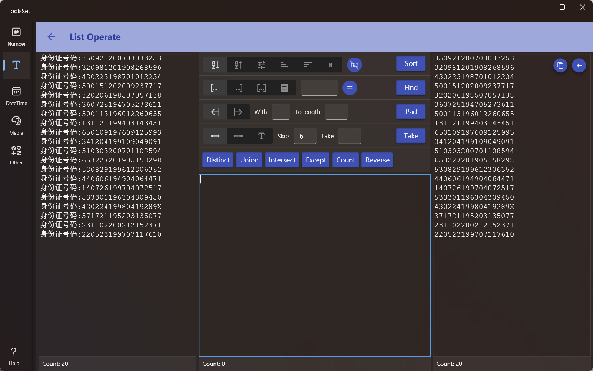

## 介绍

提供多种对列表文本的操作，包括排序、查找、提取、去重、合并等

## 使用方法

* 在左侧文本框中输入待处理的文本
* 中间部分为操作区，可执行的操作有
  * Sort：按照指定方式排序，方式包括字母升序、字母降序、随机排序、长度升序、长度降序、倒序
    * 方式选项右侧的开关表示是否使用数字排序，默认关闭，即使用字母排序，仅对前两种排序方式起作用
  * Find：按照指定方式查找项，方式包括开始文本、结束文本、包含文本、指定文本
    * 文本框右侧开关可以切换相等和不等状态
  * Pad：使用指定字符填充文本到指定长度，可以指定在开始或结束位置填充
    * 不指定字符时默认使用空格填充，不指定长度时将每项都填充至最长项的长度
  * Take：从起始或结束位置开始提取指定的字符，可以指定跳过及提取数量或字符
    * 默认时跳过和提取参数为数字，可以通过选择停止字符来切换到字符
    * 字符判断时将从起始位置开始，可以指定判断方式为相等或不等
  * 下方为无参数或一个列表参数的操作，列表参数可以在下方文本框中输入
    * Distinct：去除列表中的重复项
    * Union：合并两个列表
    * Intersect：获取两个列表的交集，即两个列表中都存在的项
    * Except：获取第一个列表中存在且在第二个列表中不存在的项
    * Count：统计列表中各项的个数
    * Reverse：将列表中每个项都按字母反序
