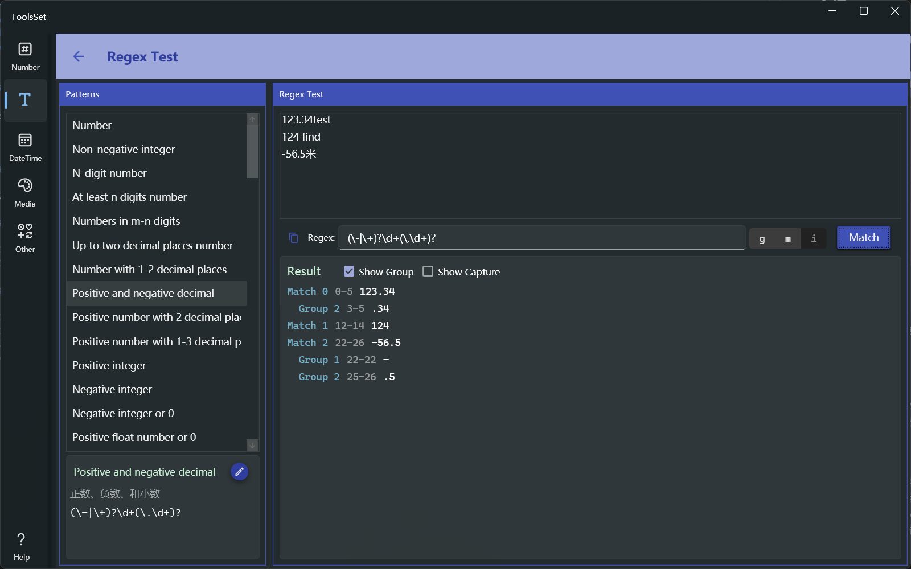

## 介绍

提供数十种预定义的常用正则表达式匹配规则，可以对其进行编辑，也可以测试自定义正则表达式，可以查看匹配结果的分组和捕获

## 使用方法

* 左侧列表显示了预定义正则表达式的名称，选择之后会在下方显示其内容和说明，可以点击下方右侧的按钮将其复制到右侧测试区域的表达式文本框中进行编辑和测试
* 测试时在右侧上方文本框输入待查找的文本，表达式文本框中输入正则表达式，右侧三个选项分别为：全局搜索、多行和忽略大小写，然后可以点击【Match】按钮进行匹配搜索
* 下方区域会显示匹配结果，可以选中显示分组来查看其中的分组，可以通过分组后选中显示捕获来查看捕获
  > 结果中的数字表示匹配的位置范围，索引从0开始