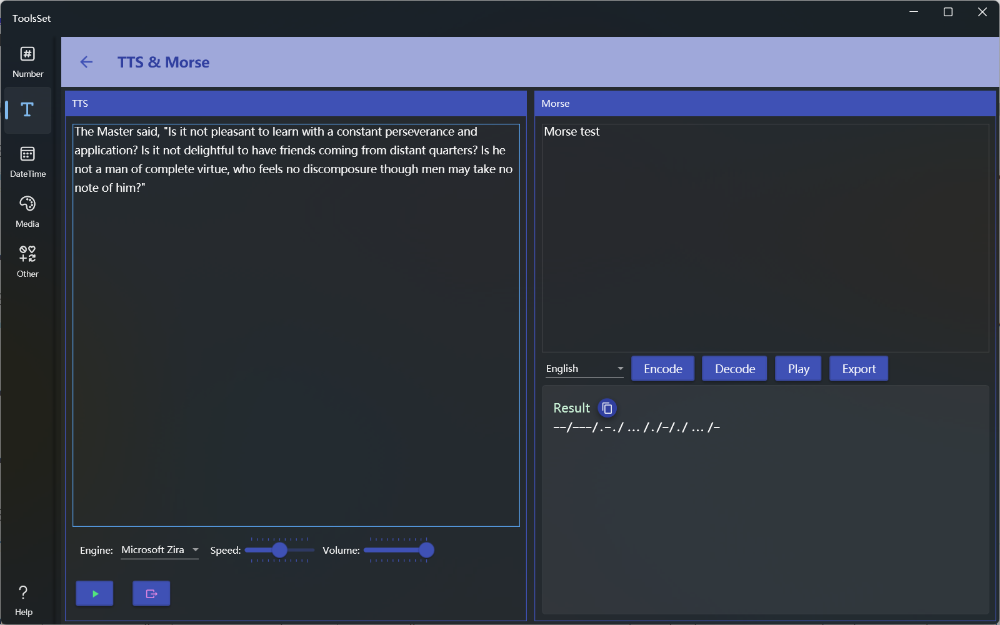

## 介绍

使用系统安装的语音库将文本转换为语音，以及文本和摩斯电码相互转换，支持播放音频及导出音频文件

## 使用方法

左侧为文本转换语音区域，右侧为摩斯编码解码区域

### 文本转换语言

* 在上方文本框中输入待转换文本，从下拉框选择要使用的语音引擎，可以用右侧滑动条调节语音速度和音量，下方两个按钮分别用于播放和导出语音

### 摩斯编码解码

* 在上方文本框中输入待转换文本，从下拉框选择语言，点击【Encode】可以将文本转为摩斯码，点击【Decode】可以将摩斯码转为文本，点击【Play】可以播放摩斯码音频，点击【Export】可将音频导出到文件
  > 日语转换仅支持片假名

