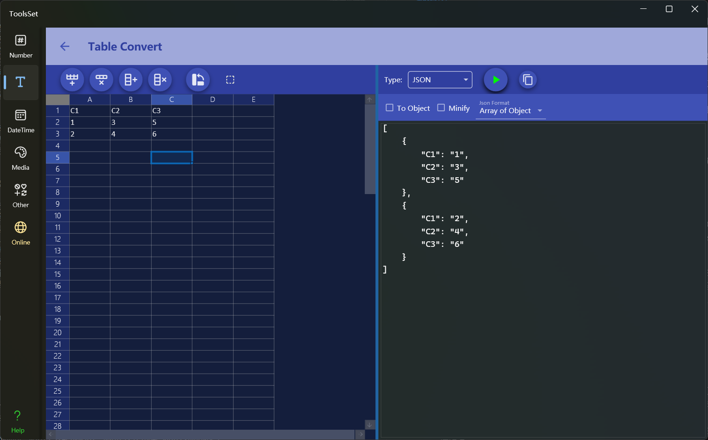

## 介绍

此工具可以将表格中的数据转换为Csv、Json、Xml、Html、Markdown、Sql、Yaml等格式的文本

## 使用方法

左侧为数据输入区域，右侧为数据转换区域

* 数据输入
  * 在左侧表格中输入文本即可，支持复制以Tab分隔的数据，第一行在转换时将作为表头/标题（如果结果需要表头/标题数据）
  * 上方左侧四个按钮分别为：添加行、删除行、添加列、删除列操作
  * 第五个按钮为行列转置操作，点击后可以进行行列互换
  * 最右侧为选区操作开关，打开后将对选择区域进行数据转换，否则会对所有数据进行转换
* 数据转换
  * 在上方下拉框可以选择转换类型，其中包括：Csv、Json、Xml、Markdown、Html、ASCII、Sql Insert、Sql Update、Yaml、C# Object，选择类型后下方可以设置相应的格式参数
    * Csv：可以设置是否用引号包裹数据、分隔符类型、每行数据的前缀和后缀
    * Json：可以设置是否转为对象、是否压缩、数据格式
    * Xml：可以设置是否包含命名空间、是否转为对象、是否压缩
    * Markdown：可以设置是否转义、是否包含标题行、是否美化对齐、是否简化、标题是否加粗以及对齐方式
    * Html：可以设置是否包含标题行、是否使用div标签、是否压缩、是否使用thead和tbody标签
    * ASCII：可以设置是否对每行分隔、表格风格、对齐方式、注释字符类型
    * Sql Insert：可以设置表名、是否生成删表语句、是否生成建表语句、引号类型、是否一次插入
    * Sql Update：可以设置表名、引号类型、主键列序号
    * Yaml：可以设置生成的数据格式
    * C# Object：可以设置类型名称、生成对象的类型
  * 点击右侧转换按钮即可将表格数据转换为指定格式的文本
  * 最右侧的按钮用于快速复制转换结果
