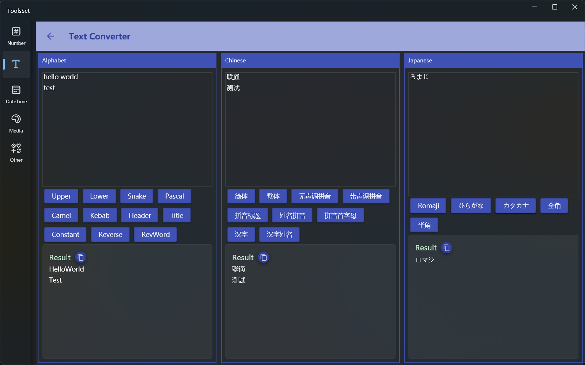

## 介绍

提供各种文本转换，包括英文大小写、中文简体繁体、中文拼音、日文平假名片假名转换等

## 使用方法

左侧为字母转换区，中间为中文转换区，右侧为日文转换区

### 字母转换

  * Upper：所有字母转为大写，比如 Hello World -> HELLO WORLD
  * Lower：所有字母转为小写，比如 Hello World -> hello world
  * Snake：小写且单词间用下划线连接，比如 Hello World -> hello_world
  * Pascal：删除空白且单词首字母大写，比如 Hello World -> HelloWorld
  * Camel：删除空白且转为首字母小写的驼峰模式，比如 Hello World -> helloWorld
  * Kebab：小写且用中划线连接，比如 Hello World -> hello-world
  * Heder：单词首字母大写且用中划线连接，比如 Hello World -> Hello-World
  * Title：单词首字母大写，比如 hello world -> Hello World
  * Constant：大写且单词间用下划线连接，比如 Hello World -> HELLO_WORLD
  * Reverse：大小写反转，比如 Hello World -> hELLO  wORLD
  * RevWord：以单词为单位反转顺序，比如 Hello World -> World Hello  
  > Snake、Kebab、Heder、Constant这四种转换会自动按字母大小写划分单词

### 中文转换

  * 简体：繁体中文转为简体，比如 测试 -> 測試
  * 繁体：简体中文转为繁体，比如 測試 -> 测试
  * 无声调拼音：将中文转为不带声调的拼音，如果是多音字会在括号中显示所有拼音，比如 重量 -> [zhong, chong] liang
  * 带声调拼音：将中文转为带声调的拼音，如果是多音字会在括号中显示所有拼音，比如 重量 -> [zhòng, chóng] [liàng, liáng, liang]
  * 拼音标题：将中文转为不带声调的拼音且大写，如果是多音字会在括号中显示所有拼音，比如 重量 -> [ZHONG, CHONG] LIANG
  * 姓名拼音：将**一个汉字**转为在姓名中的发音，比如 单 -> shàn
  * 拼音首字母：将中文转为拼音的首字母，如果是多音字会在括号中显示所有拼音，比如 重量 -> [z,c] [l]
  * 汉字：将**一个拼音**转为汉字，包括以此拼音开始的所有汉字，比如 sen -> 僧 幓 曑 森 椮 槮 穼 篸 罧 蔘 襂 鬙
  * 姓名汉字：将**一个拼音**转为用于姓名的常用中文，包括以此拼音开始的所有汉字，比如 si-> 斯 司 司空 司寇 司马 司徒 似 姒

### 日文转换

  * Romaji：将平假名或片假名转为罗马字，比如 わたし -> watashi
  * ひらがな：将罗马字或片假名转为平假名，比如 watashi -> わたし
  * カタカナ：将罗马字或平假名转为片假名，比如 watashi -> ワタシ
  * 全角：将半角字符转为全角字符，比如 （カタ） -> (ｶﾀ)
  * 半角：将全角字符转为半角字符，比如 (ｶﾀ) -> （カタ）
  
> 所有转换结果都可以通过点击复制按钮复制到剪贴板