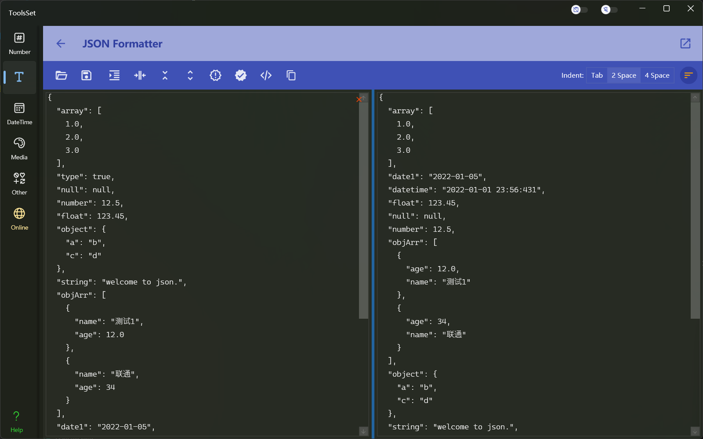

## 介绍

Json工具提供格式化、压缩、扁平化、转为XML的功能，XML工具提供格式化、压缩、转为Json、XPath查找的功能

Json 工具：

XML工具：

## 使用方法

两个工具的使用方法非常简单，点击工具栏按钮即可完成操作
> 都支持打开文件、粘贴文本、输入文本三种方式来提供输入
> 
> 编辑结果都支持保存到文件和复制操作
>
> XML工具的XPath查找结果支持以OutterXML、InnerXML、InnerText三种方式显示
