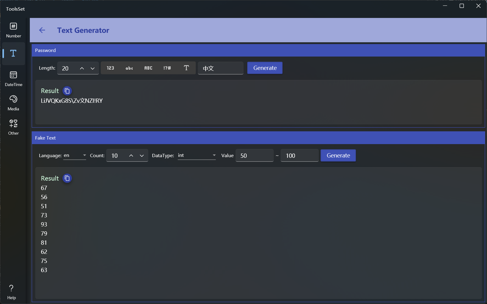

## 介绍

提供按指定规则生成随机密码和文本假数据功能

## 使用方法

上方为随机密码生成区域，下方为文本假数据生成区域

### 生成密码

* 规则设置
  * 长度：范围为1~256
  * 字符：通过右侧列表选择字符类型，可以多选。类型包括：数字、小写字母、大写字母、特殊字符、自定义字符
    > 类型没有选择和全部选择的效果一样
* 规则设置好之后点击生成按钮即可在下方生成包含指定字符的指定长度的随机密码，可以点击复制按钮快速复制

### 生成假数据

1. 选择语言：下拉框提供了12中预定义语言供选择，所选语言在指定数据类型下不存在时将会使用英文
2. 设置数量：范围为1~200
3. 选择数据类型：数据类型下拉框提供了三十余种数据类型供选择，包括常用的数值类型、字符串、日期时间、Guid、IP、姓名、颜色、地址等
4. 设置参数：数值类型和日期类型可以设置数据范围参数，字符串类型可以设置长度参数
5. 生成数据：点击右侧生成按钮，即可在下方按指定规则生成指定数量的随机数据，可以点击复制按钮快速复制