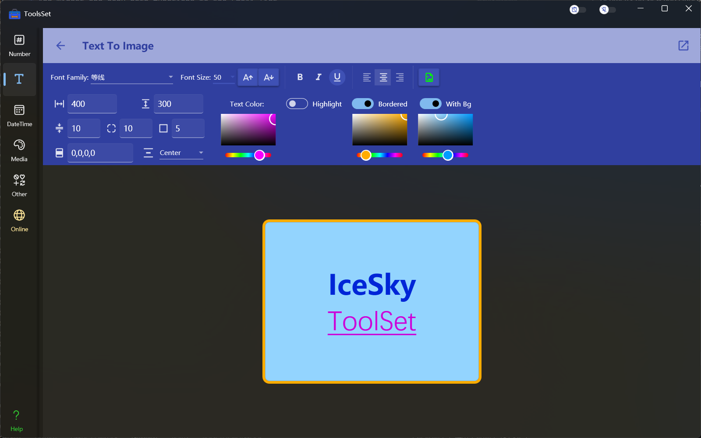

## 介绍

文本转换图片工具，可以将输入的带格式的富文本内容转换为图片保存

## 使用方法

* 界面上方为参数设置区域，可以设置的参数包括：
  * 字体：在下拉框中选择系统安装的字体
  * 字号：在下拉框中选择常用字号，也可以在输入框中直接输入字号，最大字号为500；点击字号右侧的两个按钮可以增加或减小字号
  * 字体风格：点击后可以切换黑体、斜体、下划线
  * 水平对齐方式：可以选择段落的水平对齐方式，包括左对齐、居中对齐、右对齐
  * 输出图片的宽度和高度：宽度最小为20，高度设置为0时将会根据内容自动调整
  * 行间距：可以设置两行文本直接的距离，最小值为1
  * 圆角：设置背景的圆角大小
  * 边框宽度：设置图片的边框宽度，在开启边框后有效
  * 边距：设置文本和边框间的距离，四个值分别为左、上、右、下的距离
  * 垂直对齐方式：如果选中文本则设置文本的对齐方式，否则将设置整体文本的垂直对齐方式，包括顶部对齐、中间对齐和底部对齐
  * 文本颜色：通过选择设置文本的颜色
  * 高亮色：通过选择设置文本的背景颜色，未开启时没有高亮
  * 边框颜色：通过选择设置边框的颜色，边框宽度大于0时可见，未开启时无边框
  * 背景颜色：设置整个图片的背景色，未开启时背景透明
* 界面下方可以进行文本编辑
* 点击上方工具栏的保存按钮可以将编辑好的文本保存为图片文件
