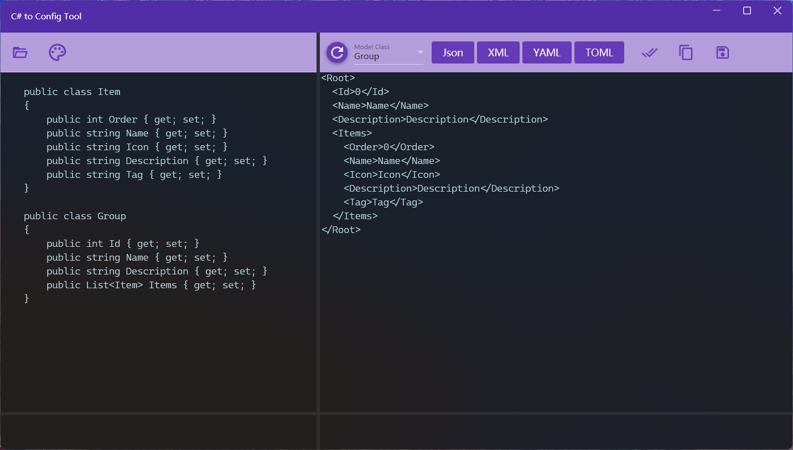

## 介绍
C#2Config这款Windows应用可以实现将C#实体类转换为Json、XML、YAML和TOML四种格式字符串， 具备检查C#类代码并识别实体类、从文件打开或粘贴类代码、检查转换及修改后的文本内容、保存转换结果为配置文件等功能。

此应用可以用于需要根据C#实体类生成Json字符串或配置文件的各种场合，比如Api测试时需要根据DTO生成Json Request，或者开发测试过程中需要读取配置文件等。

## 使用方法
1. 输入C#类代码：可以点击左侧【打开】按钮从.cs文件打开实体类，或者在左侧文本区粘贴类代码。
   > 应用已经添加“Newtonsoft.Json”、 “System.Text.Json” 和“System.Runtime.Serialization”三个类库的引用，所以可以在C#类代码中使用这三个类库中的特性，例如属性重命名、指定顺序等。

   > 左侧上方第二个按钮可以修改文本框的文本颜色

2. 解析类代码：点击右侧【刷新】按钮解析类定义代码，解析时会对实体类进行验证，如有错误会在左侧下方显示编译错误。
3. 选择转换类：解析完成后可以在下拉框选择要转换的类。
4. 转换格式：点击右侧按钮进行转换，将类代码序列化成对应格式的配置字符串。
5. 调整内容：初始生成的配置数据为各个字段的默认数据，可以根据需要在右侧对数据内容进行修改，比如修改数值或者对列表和字典类型的数据通过复制的方式增加数量。
6. 验证结果：修改完成后可以点击右侧验证按钮对配置内容进行验证，验证通过表示内容可以被反序列化为对象。
7. 使用结果：点击右侧按钮复制内容或将其保存成文件。

## 要求及限制
* 每次转换一个类
* 所有引用的类需要在一个文件中
* 实体类需要语法正确，可以编译通过
* 列表和字典类型未初始化时会生成一个子元素，需要多个时需要手动复制

XML转换效果如下：

[商店下载](https://apps.microsoft.com/detail/9P7FCM5T6BXZ)