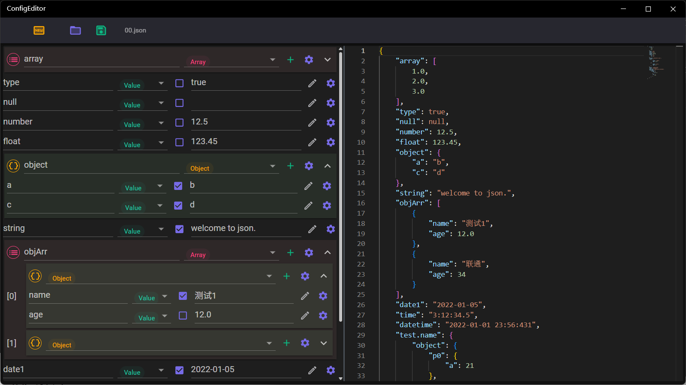

## 介绍
JSON格式文件的编辑工具，可用于创建、查看、编辑JSON格式的文件，支持表单编辑、语法高亮和自动格式化。

## 使用方法

1. 上方工具栏按钮功能分别为：创建新的JSON、打开JSON文件、保存JSON文件，创建新JSON时可以选择Array或者Object。
2. 左侧为节点编辑区，可以对JSON文件中的节点进行编辑，其中可以进行的操作包括：
   * 属性名修改：普通属性可以在左侧文本框编辑属性名
   * 节点类型修改：类型下拉框可以选择节点类型，包括：值、对象和数组
   * 字符串值类型切换：值属性可以使用复选框选择是否为字符串类型的值
   * 快速输入值：属性值可以通过右侧编辑图标的弹出菜单快速输入值，支持的值包括：true、false、日期、时间、颜色
   * 快速添加子节点：对象和数组类型可以通过点击“+”图标添加子节点
   * 节点编辑及排序：节点最右侧的齿轮图标用于进行节点操作，支持的操作包括：追加节点、复制节点、节点上移、节点下移、删除节点

3. 右侧为文本查看及编辑区域，右侧编辑后鼠标焦点离开编辑区将会自动进行格式检查，格式检查通过后会自动进行格式化并将内容同步到左侧。

>! 在左侧进行编辑后不支持撤销，右侧编辑后如果未同步到左侧可以撤销，同步后不能撤销

[商店下载](https://apps.microsoft.com/detail/9NCHH4G7WRN7)