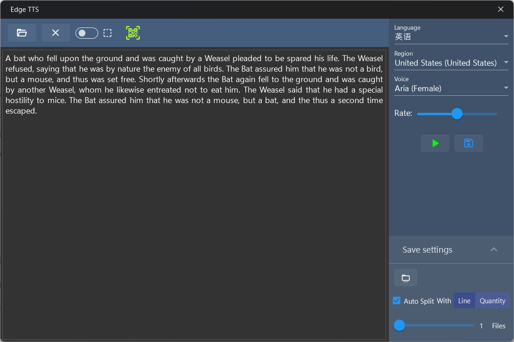

## 介绍
文本转语音工具，调用Edge TTS API将指定文本转换为语音，支持多国语音及方言，可以将转换结果保存为音频文件。

## 使用方法

1. 在左侧文本框输入文本或点击上方打开文件按钮打开文本文件，支持最大的文件尺寸为100kb。
2. 在右侧配置区域依次配置语音、区域和声音，可以选择设置语音速率。
3. 点击播放按钮即可播放转换后的语音，播放时可以暂停和停止播放。
   > 播放开始后不能修改声音参数，如果要修改参数，需要先停止播放。

4. 点击播放按钮右侧的保存按钮可以将语音保存为mp3文件。
5. 保存文件前可以在下方设置：
   * 保存文件夹：设置mp3文件保存的目录
   * 自动分割开关：开启后可以设置自动对大文本进行分割保存，有两个选项：
     1. 按行数分割：可以指定分割行数，范围为0~200，指定为0时将生成一个文件
     2. 按文件数分割：可以指定要保存的文件数量，范围为1~20  
   
     > 开启自动分割后转换过程时间会增加，请耐心等待。
     >
     > 自动分割的音频文件名会自动添加数字序号。

  > 上方工具栏的开关按钮打开后可以进行选区转换，即只转换鼠标选中的文本。

[商店下载](https://apps.microsoft.com/detail/9NDRP25RM7Q3)