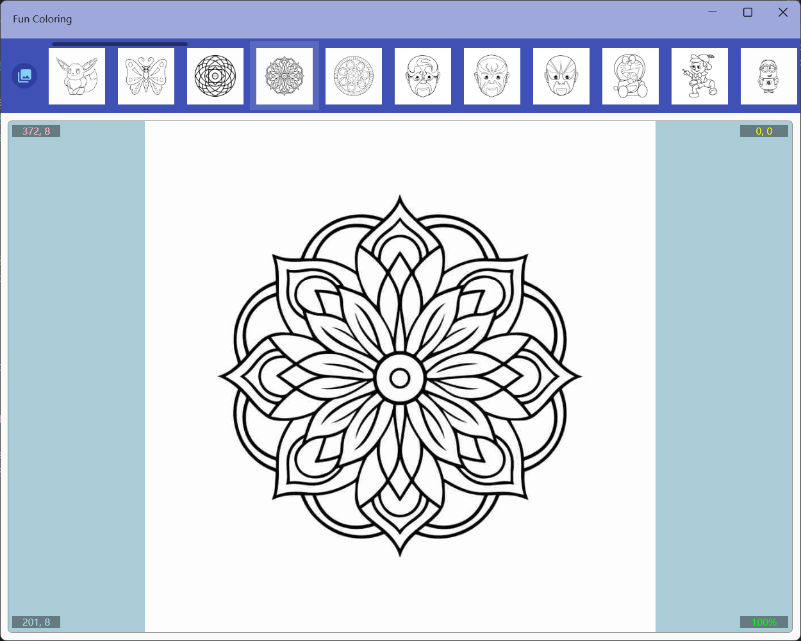

## 介绍

此应用包含五十余张多种类型的示例图片，支持打开本地图片或网络图片进行填色，可以对图片缩放平移及连续填色，可以将填色结果保存成jpg文件。

## 使用方法
上方工具栏前4个按钮为文件操作功能，作用依次为：
* 切换示例图片列表显示
* 打开本地图片文件
* 打开网络图片地址
* 保存图片

选择示例图片：

对网络图片进行填色：

图片打开之后可以通过工具栏其他按钮进行填色操作。可以执行的操作有：
* 清空所有填色
* 撤销及重做
* 模式切换：
  1. 填充模式：左键进行填充，右键拖动
  2. 清除模式：左键清除填充，右键拖动
  3. 移动模式：左键移动，右键填充
  4. 取色模式：左键设置当前颜色为点击坐标处的颜色，右键拖动
> 拖动功能只有画布放大后才能使用
>
> **填充时黑色会被锁定，无法填充和清除**
* 设置羽化范围：用于设置填充时相近颜色范围，值越小越精确，范围为0~99。
* 连续填充开关：开启后可以进行连续填充，可以填充和点击位置相同的颜色区域和白色区域，鼠标按下拖动就可以把所有经过的可以填充区域用指定颜色进行填充。
* 颜色选择：可以在下拉框中用调色板选择颜色，也可以点击右侧色板快速指定。

## 快捷键
* Ctrl+o  打开本地文件
* Ctrl+u  打开网络Url
* Ctrl+s  保存到本地文件
* Ctrl+c  切换连续模式
* Ctrl+f  切换到填色工具
* Ctrl+e  切换到清除工具
* Ctrl+m  切换到移动工具
* Ctrl+p  切换到取色工具
* Ctrl+z  撤销
* Ctrl+y  重做
* Ctrl+delete  清除填色
* Ctrl+r  重置图片大小及位置
* Ctrl+n  将图片还原为初始状态
* 鼠标滚轮可以缩放画布

[商店下载](https://apps.microsoft.com/detail/9NMDVK2Z3D9P)