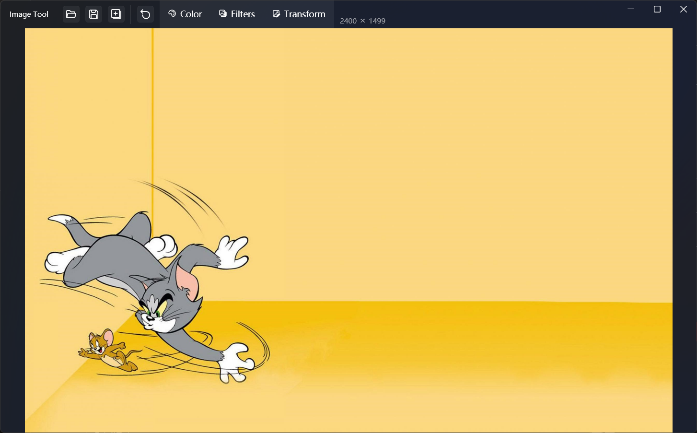
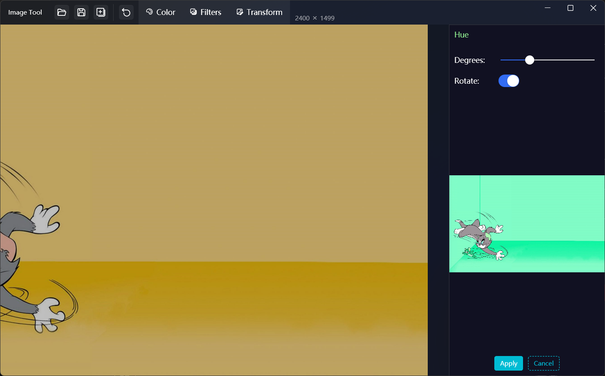
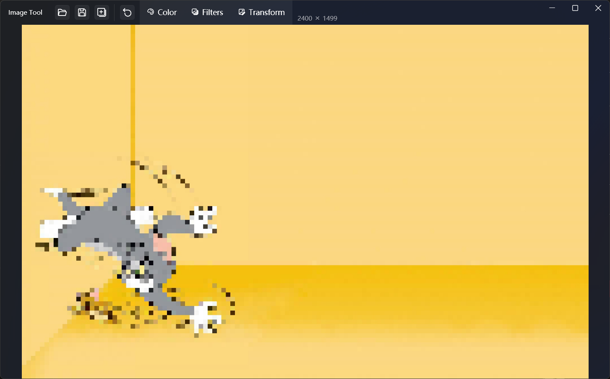
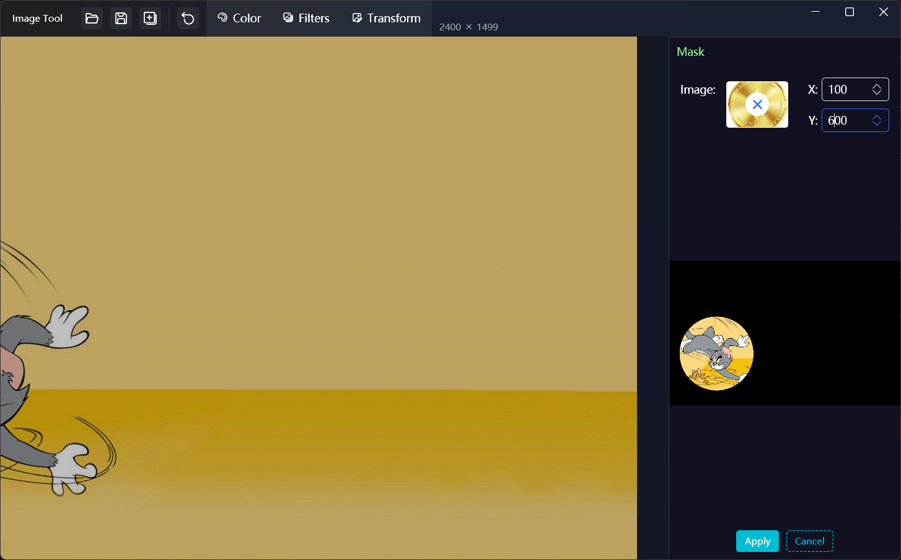
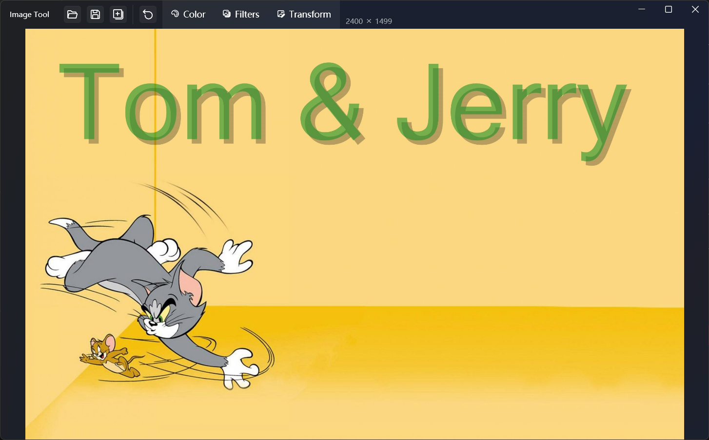

## 介绍
一款简单易用的图片编辑处理工具，支持对图片进行颜色调整、添加滤镜、进行变换，菜单栏左侧4个按钮分别可以打开图片、保存图片、保存副本、重置图片。

> 在菜单进行操作时会在窗口右侧打开预览，点击应用按钮才会将效果应用到左侧，应用效果后可以在菜单选择其他操作进行连续修改。

### Color菜单
可以对颜色进行调整，其中包括：
* 改变背景色：可以设置png格式的透明背景为指定颜色
* 调整亮度：调整图片的亮度
* 调整对比度：调整图片的对比度
* 调整饱和度：调整图片的饱和度
* 调整色相：调整图片的色相，Rotate可以设置是否调整成一个色调
* 色彩调整：通过给图片添加一个指定颜色的透明蒙版来调整整体色彩
* 灰度模式：把图片进行去色处理，变成灰度
* 黑白图片：把图片变成黑白模式
* 反色：把图片反色
* 颜色替换：将图片中的一种指定颜色替换成另外的颜色，可以设置容差值
  

### Filter菜单
可以对图片添加滤镜，其中包括：

* 查找边缘：根据指定算法类型对图片进行边缘查找，可以指定为灰度模式
* 漫画：把图片转换成漫画效果
* 哥谭：把图片转换成哥谭的高级暗灰色调效果
* 高饱和：把图片转换成高饱和效果
* 低饱和：把图片转换成低饱和效果
* Lomo胶片：给图片添加四角变暗的Lomo胶片效果
* 宝丽来：给图片添加四角变暗的宝丽来效果
* 深褐色：把图片转换成深褐色的怀旧效果
* 高斯模糊：给图片添加高斯模糊效果
* 高斯锐化：把图片进行高斯锐化处理
* 像素化：把图片按指定像素大小进行像素化处理，可以指定整幅图片或局部区域
* 光晕：给图片添加指定颜色的光晕效果
* 伽马：对图片进行伽马调整
  

### Transform菜单
可以对图片进行变换，其中包括：

* 透明度：调整图片的透明度，需要图片格式支持（如：png格式）
* 旋转：将图片按指定角度进行旋转，可以设置是否锁定图片尺寸
* 缩放：将图片按指定尺寸进行缩放，支持多种方式
* 裁剪：将图片按指定位置和尺寸进行裁剪，可以指定像素或百分比
* 熵裁剪：可以智能的裁剪图片的背景空白
* 翻转：可以将图片进行水平或垂直翻转
* 遮罩：在图片指定位置添加图片遮罩，图片将会显示遮罩图片的不透明区域
* 圆角：给图片添加圆角，可以指定四个边角的其中几个或全部
* 图片叠加：在图片指定位置叠加另一张图片，可以指定图片尺寸和透明度
* 水印：在图片指定位置添加文字水印，可以指定字号、颜色、透明度和是否有阴影
* 格式：改变图片格式，支持Jpeg、Png、Bmp、Gif和Tifff格式，Jpeg支持指定图片质量
  

  

[商店下载](https://apps.microsoft.com/detail/9MV16HSW0NLR)