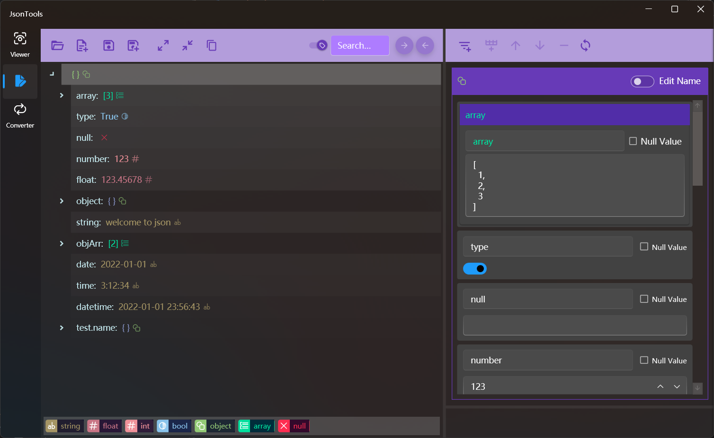

## 介绍

Json格式文本处理工具，支持Json格式的查看、编辑和多种转换功能。

### 查看菜单
* Json格式校验
* Json格式化
* 以文本方式编辑Json
* 以树形结构查看Json内容
* 不同颜色显示不同类型
* Json文本内容查找
* JsonPath查找筛选
* 节点内容查看及快速复制

> 点击中间的复制按钮，可以快速复制树形结构种选中的节点内容
>
> 关闭搜索框前面的开关，可以在搜索时排除键名
>
> 树形结构种选中节点后，点击最右侧的标题行可以快速复制节点路径

### 编辑菜单
* 打开现有Json或新建空白Json文件进行编辑
* 树形结构展示内容
* Json文本内容查找
* 按节点编辑内容
* 添加string、number、bool、array、object类型的节点
* 节点克隆、移动位置、删除节点
* 编辑节点名称和值

>! 编辑节点内容后需要点击上方最右侧的刷新按钮将数据同步到左侧树，否则修改将会丢失
>
> 将值设置为null之后节点类型将会丢失，将null值改为非null值时只能改为string，且必须输入

### 转换菜单
* 格式校验和格式化
* Josn转Json schema
* Josn转Xml
* Josn转Yaml
* Josn数组转Csv
* Josn转C#实体类
* Josn转Toml
* Josn扁平化
* 结果保存为文件

>! 转换对象是数组时，类型会根据第一个元素确定，所以数组元素格式不同时有时会因为数据类型的原因造成转换失败，这时需要检查数据类型是否一致，不一致的话需要根据情况修改第一个元素的值，使其数据类型可以包括所有数组元素。比如将 [整数类型 12] 改为 [实数类型 12.0]，将 [数字类型 1.4] 改为 [字符串类型 "1.4"]。

[商店下载](https://apps.microsoft.com/detail/9P198RFZ9RTS)