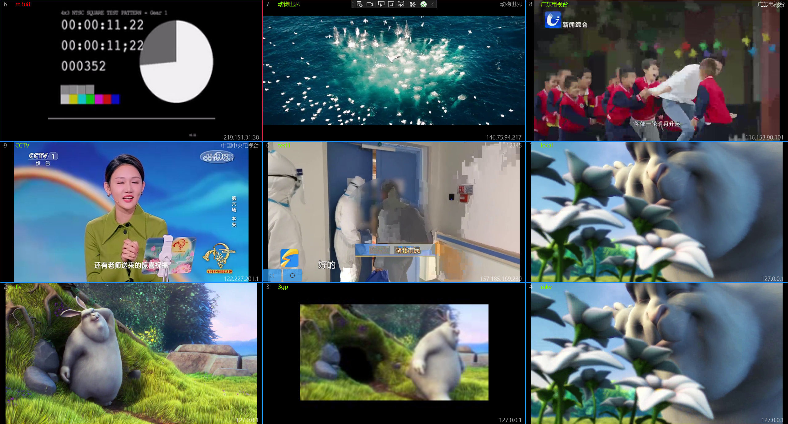
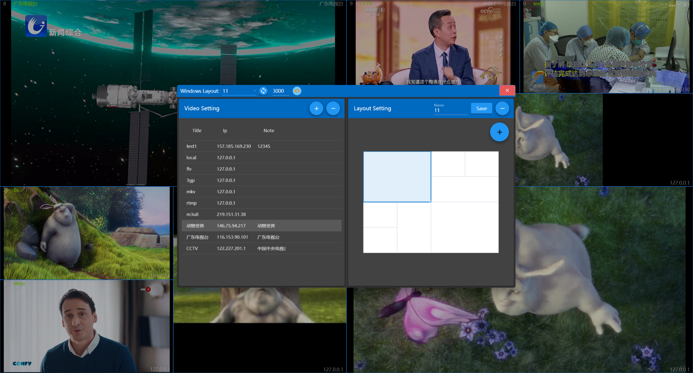
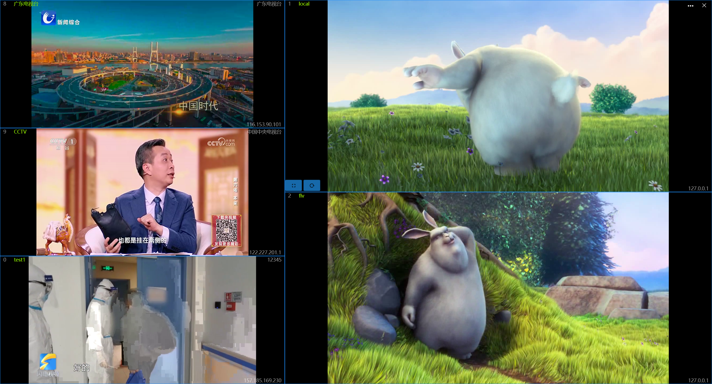
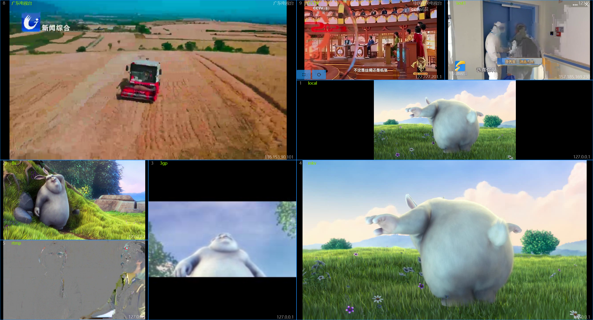

## 介绍
此应用是一款多窗口视频查看工具，可以进行多窗口视频播放，也可以作为视频监控工具使用。支持本地视频文件：mp4、flv、3gp、mkv，支持rtsp、rtmp、http、m3u8等网络视频协议。

## 使用方法
应用首次打开时为左1右1布局，没有配置视频，所以需要首先对视频进行配置。

点击关闭按钮左侧的按钮可以打开配置窗口，其中可以配置视频路径及窗口布局。
配置窗口标题栏控件的作用分别为：
1. 选择窗口布局
2. 更新界面布局为所选布局
3. 设置自动切换间隔时间，单位为毫秒，设置值小于1000时不会触发自动切换
4. 自动切换开关，开关打开且间隔时间大于1秒时生效
5. 全屏声音开关，打开后如果将视频最大化，可以播放视频声音，否则将会静音

### 配置视频
配置窗口左侧是视频配置区
* 添加视频：点击上方【+】按钮，下方会出现信息录入区，输入信息后点击保存即可。
  > 其中Ip和Url必须输入
* 修改视频：选中表格中的一行，可以修改此行的信息。
* 删除视频：选中表格中的一行后，点击上方的【-】按钮，会弹出提示信息，点击提示信息中的【OK】即可删除此纪录。
>! 视频更新后需要重启应用才会生效

### 配置布局
配置窗口右侧是布局配置区
* 使用预定义布局：在配置窗口标题栏的下拉框可以选择预定义的布局方式，选好之后点击右侧同步按钮即可同步到主窗口。
* 自定义布局：
  1. 首先选择一个预定义布局，在此布局基础上进行修改。
  2. 点击右侧浮动按钮【+】，可以在弹出菜单中点击按钮调整布局，按钮从上到下的作用依次为：添加列、删除列、添加行、删除行、合并单元格、拆分单元格。
  3. 布局调整好之后，在上方输入一个新名称点击【Save】进行保存即可。
* 修改布局：在上方选择布局并调整后，不修改名称点击【Save】可以对现有布局进行修改。
* 删除布局：在上方选择布局后，点击右侧【-】按钮即可删除布局。
  >! 正在使用中的布局不能删除

## 视频导航快捷键

* 按键【→】：下一个
* 按键【←】：上一个
* 按键【PageDown】：下一页
* 按键【PageUp】：上一页
* 按键【Home】：第一页
* 按键【End】：最后一页
* 按键【Escape】：还原窗口
* 按键【Alt+Enter】：打开跳转窗口
* 按键【Alt+Space】：切换自动轮播
* 鼠标双击视频切换全屏和窗口状态。

> 视频数量大于一页时才会生效
> 
> 按键导航需间隔2秒操作

左三右二布局：

七窗口布局：

自定义布局：

[商店下载](https://apps.microsoft.com/detail/9NCRFPFG5JB3)