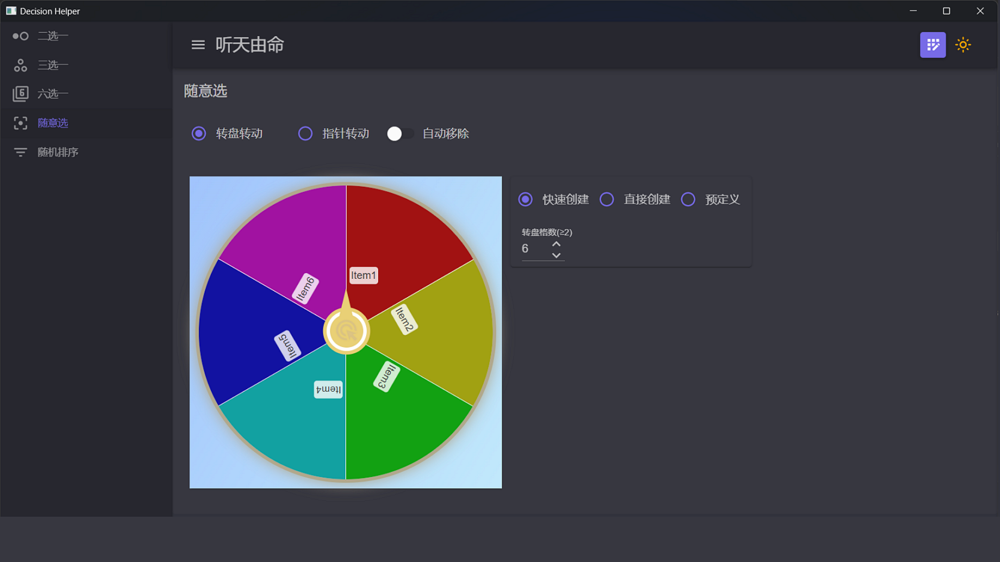
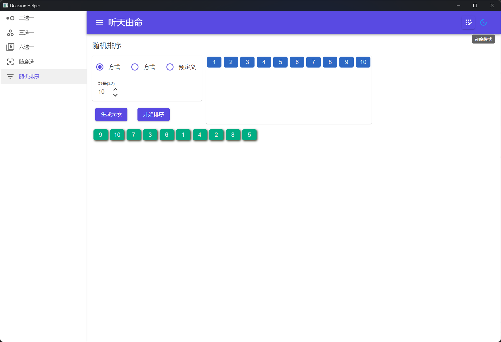

## 介绍
功能包括随机的二选一、三选一、六选一、转盘、随机排序，每种选择都提供了多种方式风格，界面支持明暗主题切换，支持自定义选项。

### 二选一
从两个选项中进行选择。
* 具有三种样式：样式一和二为两种不同的硬币样式，旋转方式不同，样式三可以指定正面及反面文字。
* 可以在预定义中选择预先定义好的选项列表。
* 支持连续抛多次。

### 三选一
从三个选项中选择一个。
* 具有三种样式：样式一为石头剪刀布；样式二为红绿灯，可以指定文字；样式三为转盘，也可以指定文字。
* 可以在预定义中选择预先定义好的选项列表。

### 六选一
通过扔骰子的方式从六个选项中进行选择。
* 具有两种样式：样式一为普通六点骰子样式；样式二可以自定义各面文字。
* 可以在预定义中选择预先定义好的选项列表。
* 支持连续抛多次。

### 随意选
通过转转盘的方式从多个选项中进行选择。
* 可以选择转动转盘或指针，可以选择是否在选中之后自动删除选中项。
* 【快速创建】可以指定数量后自动创建选项；
* 【直接创建】可以直接输入选项创建选项；
* 【预定义】可以选择预先定义好的选项列表。

### 随机排序
生成指定数量的选项，对其进行随机排序。
* 【方式一】可以指定数量后创建数字选项；
* 【方式二】可以直接输入选项创建选项；
* 【预定义】可以选择预先定义好的选项列表。
> 数量或选项改变后都需要先点击【生成元素】，再点击【开始排序】进行随机排序。

### 预定义选项
可以对各种方式进行选项预定义。
* 点击右上角【预定义选项】按钮可以打开预定义选项组，可以在界面中对预定义组进行操作。
* 添加：点击【添加组】，在弹出窗口输入名称，选择类型，输入选项后保存即可，其中只有自定义方式可以修改选项数量。
* 修改：点击选项组列表中的一项即可弹出窗口进行修改。
* 删除：点击选项组列表前的删除按钮会弹出确认对话框，点击确认即可删除。

主题切换：应用右上角的按钮可以切换应用明暗主题。

[商店下载](https://apps.microsoft.com/detail/9N2S39RTRPB6)

[PWA版](https://apps.microsoft.com/detail/9PMKD8SSQZH7)

[在线使用](https://makedecision.azurewebsites.net)