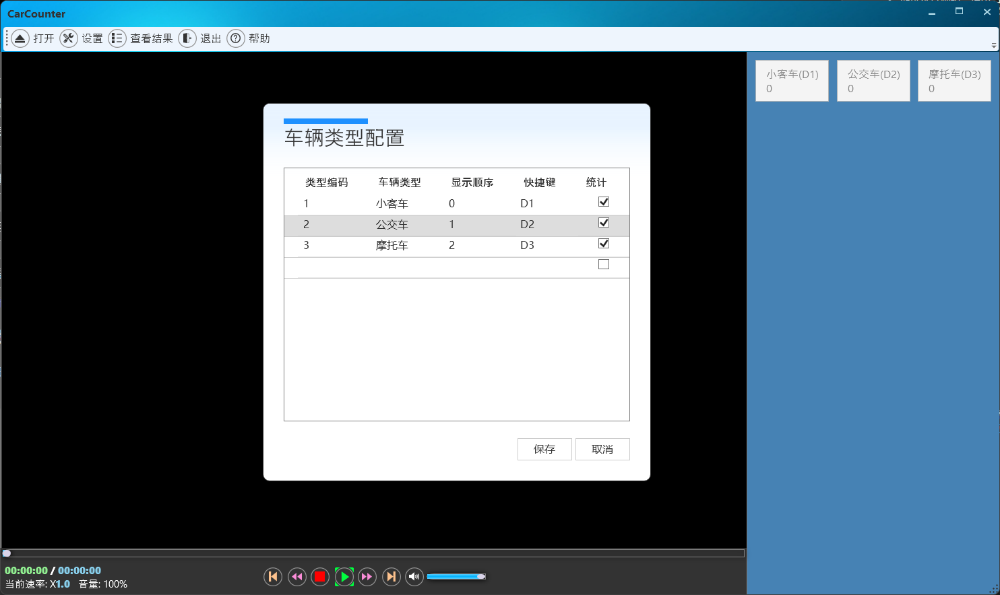

## 介绍
流量统计工具，可以根据类型统计交通人流量或车流量，并将结果导出。

## 使用方法

1. 打开视频文件：点击菜单栏的【打开】按钮，选择准备统计的视频。
2. 配置统计内容：点击菜单栏的【设置】按钮，弹出类型配置对话框。
   

* 添加：单击表格中的空行，即可添加一行，输入信息保存即可。
  > 其中类型必须输入，快捷键输入方式为：激活快捷键单元格后，直接按下键盘按键即可
  > 选中复选框的作用是指定类型是否在右侧操作区显示
* 修改：鼠标双击想要编辑的单元格即可编辑内容，完成后点击保存即可。
* 删除：选中一行后按下键盘【Delete】按键即可删除，点击保存按钮之后才会生效。

3. 统计数量：点击播放器下方的【播放】按钮播放视频，在播放过程中按下配置的快捷键或直接点击右侧按钮统计对应类型的数量。
4. 查看结果：点击菜单栏的【查看结果】按钮，弹出结果查看对话框，可在其中查看统计数量和详细信息。
5. 导出结果：点击结果查看对话框中下方的【保存】按钮，可以将结果保存到excel文件。
   
> 此应用也可作为视频播放器使用，控制功能支持播放、暂停、加速播放、减速播放、前进5秒、后退5秒、进度及音量控制

[商店下载](https://apps.microsoft.com/detail/9NW2XDGDKZHM)