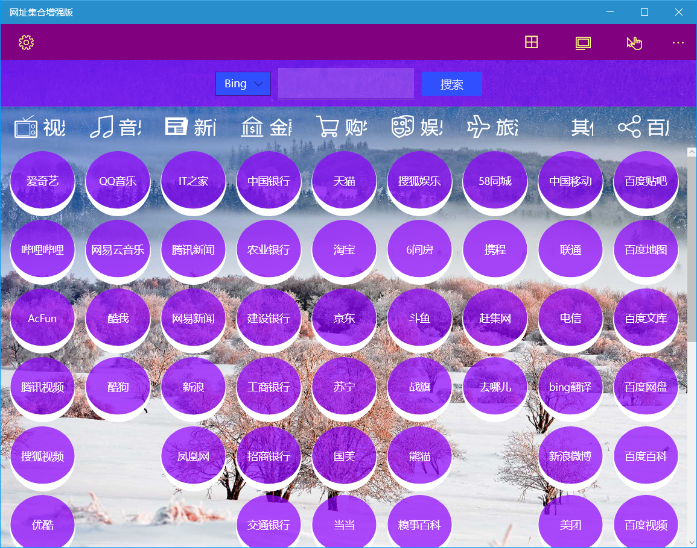

## 介绍

此应用提供了一些常用的网页应用集合，分为普通版和增强版，用户也可以自定义分类和网址，保存常用网站的桌面版和移动版地址。

### 普通版使用方法
#### 首页菜单
首页上方工具栏按钮的功能依次为：分类管理、站点管理、首页背景、标签背景、移动版。

应用预置了音乐、视频、新闻、金融、购物、娱乐等类别，每个分类包含数个网站。

点击各个标签即可进入相应网站。

进入网站后上方工具栏右侧按钮作用依次为：返回首页、刷新网页、后退、前进和用户信息。

> 如果选中移动版，则打开网站时如果设置了移动版地址则会打开移动版地址。

#### 调整界面风格
* 点击首页上方工具栏的首页背景按钮，可以在弹出的25种预定义颜色中选择一种作为首页背景颜色。
* 点击首页上方工具栏的标签背景按钮，可以在弹出的25种预定义颜色中选择一种作为标签背景颜色。标签还可以通过滑动条调整透明度。

#### 编辑分类
点击首页上方工具栏的分类管理按钮可以对分类进行修改。

* 添加：点击【添加分类】按钮，输入分类名称，可以选择图标和颜色，点击【保存】即可。
* 修改：选择一个分类，可以修改其名称、图标和颜色，点击【保存】即可。
* 删除：点击分类右侧的删除图标，在弹出对话框中点击【确定】按钮，即可删除分类。
  >! 如果分类中已经添加了站点，就需要先删除分类中的所有站点之后才能删除分类。

#### 编辑网站
点击首页上方工具栏的站点管理按钮可以对站点进行修改。

* 添加：点击【添加网站】按钮，在右侧选择分类，输入网站名称，桌面版地址或移动版地址，用户信息及备注可选，点击【保存】即可。
* 修改：在左侧下拉框选择分类，点击所选分类中要修改的网站，在右侧修改参数，点击【保存】即可。
* 删除：选择分类后，点击网站右侧的删除图标，在弹出对话框中点击【确定】按钮，即可删除网站。

#### 使用用户信息

* 编辑用户信息：可以在编辑网站对话框中修改用户名、密码和备注供打开网站时使用。
  > 为了安全起见，建议密码不要保存明文，而应保存部分掩码的提示信息。
* 使用：打开网站后，点击上方工具栏的用户信息图标即可查看保存的信息，可以点击【复制用户名】按钮复制用户名到剪贴板，在需要的地方进行粘贴。

### 增强版使用方法
增强版增加了以下功能：

1. 可以使用Bing壁纸作为背景。
2. 可以在首页使用Bing或百度进行搜索。
3. 配色更加丰富，更多界面选项可以自定义。
4. 支持网址复制，快速添加网址。
5. 可以导入导出网站设置。

#### 首页菜单
首页上方工具栏右侧按钮的功能依次为：分类管理、网站管理、移动版。

增强版首页上方增加了搜索功能，可以在下拉框选中Bing或百度，点击搜索后将打开相应的网页显示搜索结果。

应用预置分类和网站与普通版一致。

点击各个标签即可进入相应网站。

进入网站后上方工具栏右侧按钮作用依次为：返回首页、复制路径、刷新网页、后退、前进和用户信息。

增加的【复制路径】按钮可以复制当前网址到剪贴板。
其他功能和普通版一致。

#### 应用设置
增强版增加了更多的设置功能，点击上方工具栏最左侧的设置按钮可以打开设置界面。

设置界面包括：背景设置、网站标签设置、应用设置。
* 背景设置：可以使用Bing图片作为应用背景或者使用纯色背景。
* 网站标签设置：可以设置标签的边框宽度、圆角、间距、尺寸、字号、背景色和前景色。
  > 标签的边框宽度、圆角、间距这三项设置可以分别设置上下左右四个方向的值
* 应用设置：可以设置命令栏的背景色和前景色，已经导入导出网站配置。
>增强版颜色设置可以在48种基本颜色中选择，也可以使用自定义颜色中用调色板选取。调色板支持ARGB文本输入和透明度设置。

#### 编辑分类
增强版分类编辑功能增加了分类顺序调整功能，其他功能和普通版一致。

#### 编辑网站
此功能和普通版一致。

#### 使用用户信息
此功能和普通版一致。

[商店下载](https://apps.microsoft.com/detail/9PLD6M5GCCWV)

[增强版](https://apps.microsoft.com/detail/9P89C1H8QHH7)

部分自定义界面效果展示：

